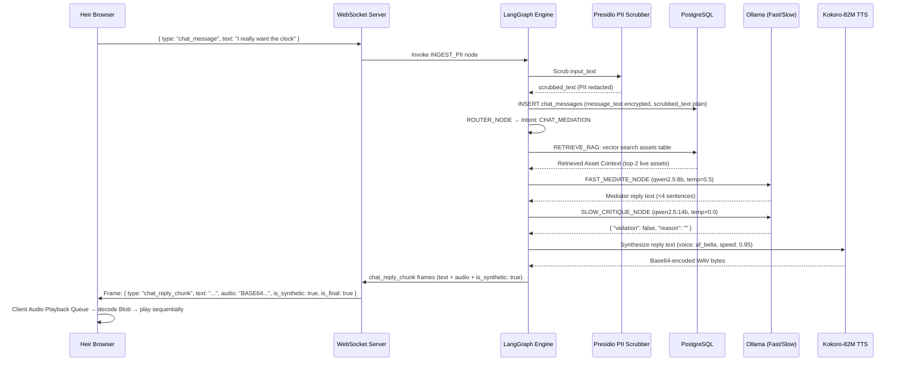
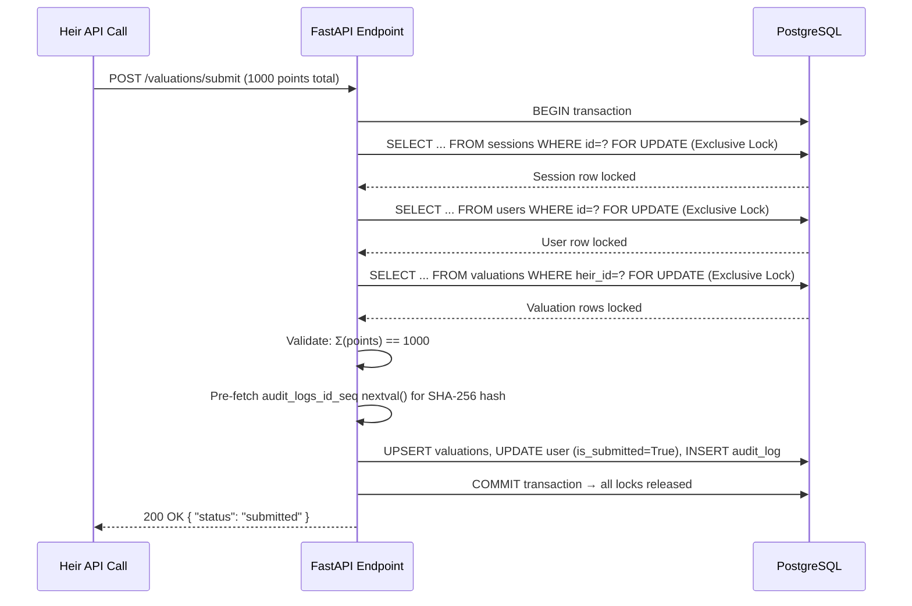

# The Estate Steward: Development Blueprint (v1.0)

This blueprint maps the technical architecture, data pipelines, model configurations, and developer blueprints for **The Estate Steward** estate division and mediation platform.

---

## 0. Prerequisite: uv Virtual Environment Setup

Before any development, the backend Python environment must be initialized using `uv` (the project's Python package manager):

```bash
# Navigate to the backend directory
cd backend

# Create a uv virtual environment and install all dependencies
uv sync

# Activate the virtual environment
source .venv/bin/activate
```

The `uv sync` command reads `backend/pyproject.toml` and installs all declared dependencies (FastAPI, SQLAlchemy, LangGraph, Presidio, Kokoro-ONNX, etc.) into an isolated `.venv` directory. This must be done before running any backend tests, starting the FastAPI server, or executing any Python scripts.

---

## 1. System Architecture Diagram

```mermaid
graph TB
    Client[Web Browser Client - React SPA] <-->|HTTP / WebSockets| Nginx[Nginx Reverse Proxy]
    Nginx <-->|Port 8000| API[FastAPI Gateway Engine]
    
    subgraph Python Backend Services
        API -->|ORM / SQL| DB[(PostgreSQL + pgvector)]
        API -->|Thread State Store| Checkpointer[LangGraph PostgresSaver]
        API -->|PII Filter| Presidio[Microsoft Presidio Engine]
        API -->|Math Solver| Fairpyx[Fairpyx Division Solver]
        API -->|PDF Builder| ReportLab[ReportLab PDF Engine]
    end
    
    subgraph Local LLM Compute (Ollama)
        API -->|Port 11434| Ollama[Ollama Server]
        Ollama -->|Fast Chat| Qwen8B[Qwen-2.5-8B-Instruct]
        Ollama -->|Slow Logic & Critique| Qwen14B[Qwen-2.5-14B-Instruct]
        Ollama -->|Vision OCR| Llava[Llava Multimodal]
        Ollama -->|Vector Embeddings| Nomic[nomic-embed-text]
    end
```

---

## 2. Component Directory Map

```
estate_agent/
├── docker-compose.yml     # Multi-container orchestration
├── nginx.conf             # Web server and reverse proxy config
├── specs.md               # Specifications Index
├── DEVELOPMENT_BLUEPRINT.md # System architecture blueprint
├── backend/
│   ├── Dockerfile         # Python 3.11 environment build script
│   ├── requirements.txt   # Third-party python dependencies
│   └── app/
│       ├── main.py        # FastAPI routes & WebSocket endpoints
│       ├── database.py    # SQLAlchemy connection pool setup
│       ├── models.py      # SQLAlchemy relational models
│       ├── schemas.py     # Pydantic validation contracts
│       ├── graph.py       # LangGraph Dual-Brain state machine
│       ├── presidio.py    # Microsoft Presidio scrubbing logic
│       ├── pdf_worker.py  # ReportLab Keepsake PDF builder
│       └── division.py    # Fairpyx division integration helper
└── frontend/
    ├── package.json       # Node package manager manifest
    ├── vite.config.js     # SPA bundler configurations
    ├── index.html         # HTML entry point
    └── src/
        ├── main.jsx       # DOM bootloader
        ├── App.jsx        # Routing mapper
        ├── index.css      # Core Vanilla CSS design system tokens
        ├── store/
        │   └── store.js   # Zustand state manager
        └── components/    # Reusable view components
```

---

## 3. Configuration & Environment Variables

Create a `.env` file in the root workspace directory for environment configuration:

```bash
# Database Settings
DB_URL=postgresql+psycopg2://user:pass@db:5432/estate
ENCRYPTION_KEY=your-32-byte-base64-aes-fernet-key-here

# Ollama Configuration (Use host.docker.internal to bridge to host Ollama from docker)
OLLAMA_BASE_URL=http://host.docker.internal:11434
FAST_THINKER_MODEL=qwen2.5:8b-instruct
SLOW_THINKER_MODEL=qwen2.5:14b-instruct
VISION_MODEL=llava:7b
EMBEDDING_MODEL=nomic-embed-text

# SMTP Server Configurations
SMTP_HOST=smtp.gmail.com
SMTP_PORT=587
SMTP_USER=executor@example.com
SMTP_PASSWORD=app-specific-password
SMTP_FROM=keepsakes@estate-steward.org

# Storage Config
STORAGE_DRIVER=LOCAL # Toggles: LOCAL | GCS
GCS_BUCKET_NAME=your-gcp-bucket-name

# Debugging & Observability Settings
LOG_LEVEL=INFO      # Toggles: DEBUG | INFO | WARNING | ERROR
DB_ECHO=false       # Toggles database query prints (True | False)

```

---

## 4. Integration Verification Plan

1.  **Download Kokoro-82M TTS Assets**:
    To enable local Text-to-Speech synthesis inside the backend container, download the ONNX model and the voice profile mappings into the `backend/app/models/` directory *before* building the container so they are copied in during the build phase:
    ```bash
    mkdir -p backend/app/models
    # Download the lightweight 82M ONNX model weights
    curl -L -o backend/app/models/kokoro-v0.19.onnx \
      https://github.com/theonlygust/kokoro-onnx/releases/download/v0.2.0/kokoro-v0.19.onnx
    # Download the companion voice JSON maps
    curl -L -o backend/app/models/voices.json \
      https://github.com/theonlygust/kokoro-onnx/releases/download/v0.2.0/voices.json
    ```
2.  **Verify Ollama Models**:
    Ensure the following models are pulled and ready on the local host:
    ```bash
    ollama pull qwen2.5:8b-instruct
    ollama pull qwen2.5:14b-instruct
    ollama pull llava:7b
    ollama pull nomic-embed-text
    ```
3.  **Launch Local Infrastructure & DB Bootstrap**:
    Build and launch the Docker container network. The backend `main.py` is configured to execute the startup database lifespan sequence:
    *   **Step A (Extension Bootstrap)**: Executes a raw SQL statement `CREATE EXTENSION IF NOT EXISTS vector;` to initialize pgvector on the target database.
    *   **Step B (Table Creation)**: Invokes SQLAlchemy's `Base.metadata.create_all(bind=engine)` (or executes Alembic migrations) to construct tables, constraints, pgvector HNSW indexes, and unique composite indexes.
    *   **Step C (Admin Seeding Check)**: Verifies if any admin exists; if not, awaits the public `/api/setup/admin` call.
    Add the `--build` flag to ensure the downloaded model assets are baked into the backend image:
    ```bash
    docker-compose up -d --build
    ```
4.  **Validate Seed & Setup**:
    Verify the admin setup endpoint registers the first administrative user:
    ```bash
    curl -X POST http://localhost/api/setup/admin -H "Content-Type: application/json" \
         -d '{"username": "executor", "password": "SecurePassword123"}'
    ```
    Execute the following step-by-step curl commands to verify the database and API route integration trajectory:
    
    *   **A. Authenticate Admin (Login)**:
        Authenticates the Admin credentials and writes the returned secure HTTP-only session cookie to `cookies.txt`:
        ```bash
        curl -c cookies.txt -X POST http://localhost/api/auth/login \
             -H "Content-Type: application/json" \
             -d '{"username": "executor", "password": "SecurePassword123"}'
        ```
        
    *   **B. Create Session**:
        Creates the estate session and returns the `session_id` UUID:
        ```bash
        curl -b cookies.txt -X POST http://localhost/api/sessions \
             -H "Content-Type: application/json" \
             -d '{"title": "Melton Estate Division"}'
        ```
        
    *   **C. Register Heir**:
        Registers an heir (e.g. "Alice") and returns a secure, single-use `invite_token` UUID:
        ```bash
        # Replace {session_id} with the UUID from step B
        curl -b cookies.txt -X POST http://localhost/api/sessions/{session_id}/heirs \
             -H "Content-Type: application/json" \
             -d '{"username": "Alice"}'
        ```
        
    *   **D. Stage Asset Image**:
        Uploads an image file to trigger HEIC/WebP processing and Llava OCR extraction:
        ```bash
        # Replace {session_id} with the UUID from step B, and supply a test image
        curl -b cookies.txt -F "file=@test_asset.jpg" \
             http://localhost/api/sessions/{session_id}/assets/stage
        ```
        
    *   **E. Verify Onboarding, Age, & Consent**:
        Simulates the heir clicking "Accept & Enter Workspace" on the invite screen, verifying the token and writing client auth cookies to `heir_cookies.txt`:
        ```bash
        # Replace "HEIR_INVITE_TOKEN_UUID" with the token UUID from step C
        curl -c heir_cookies.txt -X POST http://localhost/api/invite/verify \
             -H "Content-Type: application/json" \
             -d '{"token": "HEIR_INVITE_TOKEN_UUID", "consent_accepted": true, "age_verified": true, "legal_first_name": "Alice", "legal_middle_name": "Marie", "legal_last_name": "Melton", "relationship_to_decedent": "Daughter", "date_of_birth": "1990-05-15"}'
        ```

---

## 5. SSL / Secure Context Requirements for Web Speech API

Because the Web Speech API (transcription) is a **secure context-only feature**, standard web browsers will **block microphone access** if the frontend is served over unsecure `http://` (except for `http://localhost`). 

To test voice features on mobile devices across a local network, you must deploy the system with SSL:

### Option A: Local Development Tunneling (Recommended for Fast Tests)
You can use `localtonet` or `ngrok` to expose Nginx's HTTP port 80 to a secure HTTPS URL:
```bash
ngrok http 80
```
Then navigate to the generated `https://` tunnel address on the mobile testing devices.

### Option B: Self-Signed Nginx Certificates
1. Generate a self-signed key and certificate:
   ```bash
   openssl req -x509 -nodes -days 365 -newkey rsa:2048 -keyout cert.key -out cert.crt
   ```
2. Update Nginx configuration (`nginx.conf`) to listen on port 443 with SSL enabled, mounting the keys to `/etc/nginx/certs/`.
3. Accept the browser warning on the mobile device to proceed.

---

## 6. LLM Observability & Tracing (Langfuse & Langtrace)

To trace, debug, and monitor the LangGraph System 1 / System 2 execution pathways, token counts, and step latencies, the backend supports both self-hosted Langfuse and OpenTelemetry-based Langtrace integrations:

### 6.1 Langfuse (Default Self-Hosted Dashboard)
*   **Setup**: The `langfuse` service runs in `docker-compose.yml` on port 3000.
*   **Credentials**: Add the following credentials to your local `.env` file:
    ```bash
    LANGFUSE_PUBLIC_KEY=pk-lf-your-public-key
    LANGFUSE_SECRET_KEY=sk-lf-your-secret-key
    LANGFUSE_HOST=http://localhost:3000  # Points to local langfuse container
    ```
*   **Integration Code**:
    ```python
    from langfuse.callback import CallbackHandler
    
    # Initialize the handler (automatically picks up env vars)
    langfuse_handler = CallbackHandler()
    
    # Pass to LangGraph execution config
    config = {
        "configurable": {"thread_id": "session_id:heir_id"},
        "callbacks": [langfuse_handler]
    }
    events = graph.stream(inputs, config)
    ```

### 6.2 Langtrace (OpenTelemetry SDK Integration)
*   **Setup**: Enables lightweight OpenTelemetry tracing for LangGraph.
*   **Credentials**: Add your API key to `.env`:
    ```bash
    LANGTRACE_API_KEY=your-langtrace-api-key
    ```
*   **Integration Code**:
    Add the initialization step at the very top of `backend/app/main.py` before initializing the FastAPI application:
    ```python
    import os
    from langtrace_python_sdk import langtrace
    
    # Initialize Langtrace (instruments LangGraph, Ollama, and httpx automatically)
    if os.getenv("LANGTRACE_API_KEY"):
        langtrace.init(api_key=os.getenv("LANGTRACE_API_KEY"))
    ```

---

## 7. Data Flow Diagrams

### 7.1 Chat Message Lifecycle (Input → WebSocket Chunks + Kokoro Audio)



**Key Validation Gates:**
- HITL_GUARD suspension check: If heir's thread is suspended at HITL_GUARD, WS rejects chat_message frames with error type `"error"` — socket stays open for status broadcasts.
- Critique loopback: If violation=true and critique_loopback_count ≤ 2, route back to FAST_MEDIATE_NODE. If > 2, return compliance fallback message.

### 7.2 Pessimistic Locking Sequence (Valuation Submission)



**Lock Ordering Contract (DB Spec §4.1):**
1. Lock `sessions` row FIRST (exclusive `FOR UPDATE` for write endpoints)
2. Lock `users` row SECOND (exclusive)
3. Lock `valuations` rows THIRD (exclusive)

This strict hierarchy prevents circular deadlocks when concurrent operations (draft saves, Admin overrides, expiration checks) touch the same tables.
```
