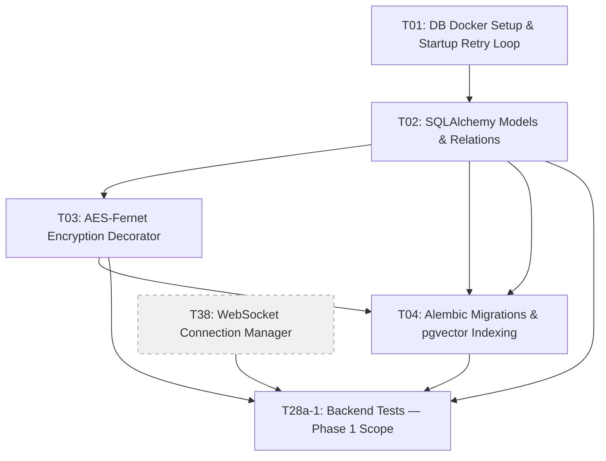

# Phase 1: Database & Core Security Foundation

## Prerequisite: uv Virtual Environment Setup
Before beginning Phase 1, the backend Python environment must be initialized using `uv` (the project's Python package manager):

```bash
# Navigate to the backend directory
cd backend

# Create a uv virtual environment and install all dependencies
uv sync

# Activate the virtual environment
source .venv/bin/activate
```

This must be done before running any backend tests, starting the FastAPI server, or executing any Python scripts. The `uv sync` command reads `backend/pyproject.toml` and installs all declared dependencies (FastAPI, SQLAlchemy, LangGraph, Presidio, Kokoro-ONNX, etc.) into an isolated `.venv` directory.

## Phase Objective
Define the relational schema, composite unique constraints, startup connection pool retries, and symmetric field-level encryption. Write incremental unit tests for these foundations. Note: A 1 to 2 business day schedule buffer is explicitly injected between Phase 1 and Phase 2 to verify pgvector compilation on target ARM64 architecture and Docker volume permission bindings on Linux.

## Technical Specifications References
* [Database Schema & Transaction Specification](file:///Users/amelton/Library/Mobile%20Documents/com~apple~CloudDocs/estate_agent/specs/specs_db.md)
* [Compliance & Privacy Specification](file:///Users/amelton/Library/Mobile%20Documents/com~apple~CloudDocs/estate_agent/specs/specs_compliance.md)
* [Legal Estate & Probate Compliance Specification](file:///Users/amelton/Library/Mobile%20Documents/com~apple~CloudDocs/estate_agent/specs/specs_legal.md)

## Detailed Requirements & Architecture
1. **Relational Schemas**: 
   * Declare SQLAlchemy models matching the ER diagram defined in the [Database Spec](file:///Users/amelton/Library/Mobile%20Documents/com~apple~CloudDocs/estate_agent/specs/specs_db.md#1-entity-relationship-model).
   * Models: `Session`, `User`, `Asset`, `Valuation`, `AuditLog`, `ChatMessage`, `SupportRequest`, `CustomFAQ`.
   * Enforce status check constraints natively in Python and SQL (e.g. `users.status` limit values, `assets.status` limit values).
   * Ensure B-Tree and unique indexes are defined (e.g., composite unique index `uq_asset_heir` on `valuations(asset_id, heir_id)`).
2. **Startup Connection Pool Retry Loop**:
   * Implement connection bootstrap in `app/database.py`.
   * Attempt database socket connections up to 5 times with a 2-second sleep delay. Prevent FastAPI process crashes if postgres container starts slower than api container.
3. **Alembic Database Migrations**:
   * Configure Alembic in the backend repository.
   * Add base migration to execute the raw SQL statement: `CREATE EXTENSION IF NOT EXISTS vector;` to enable the pgvector module.
   * Generate schemas with correct foreign keys, check constraints, and index bounds.
4. **Vector Distance Cosine Operators**:
   * Configure an HNSW index on `assets.embedding` using cosine distance operators (`vector_cosine_ops`) to support high-performance semantic search.
5. **AES-Fernet Field-Level Encryption**:
   * Write an `EncryptedJSON` Custom TypeDecorator subclassing SQLAlchemy `Text`.
   * Retrieve the 32-byte Fernet key from `ENCRYPTION_KEY` environment variable.
   * Apply this decorator to three database columns to encrypt data at rest:
     1. `audit_logs.state_snapshot` (encrypted JSON string)
     2. `chat_messages.message_text` (encrypted raw chat text)
     3. `valuations.reasoning` (encrypted heir sentimental reasons)
6. **Locking Hierarchies Contract**:
   * Enforce a strict locking order using exclusive locks (`with_for_update`) to prevent concurrent circular deadlocks:
     1. Lock Session record first (exclusive lock `FOR UPDATE` for state modifications/auditing).
     2. Lock User record second (exclusive lock `FOR UPDATE`).
     3. Lock Valuations third (exclusive lock `FOR UPDATE` on related point allocations).
7. **Argon2 Password Hashing**:
   * Add `argon2-cffi` to `backend/requirements.txt` to ensure secure password verification for the administrator account setup and login.
8. **Shared WebSocket Connection Manager**:
   * Implement `app/websocket_manager.py` in Phase 1 as a shared singleton utility (**Task T38**). It holds active WebSocket connections and exposes standard JSON broadcast helpers (`broadcast_session_status`, `broadcast_announcement`, etc.). This enables subsequent REST API routes in Phase 3 and Phase 4 to perform WebSocket broadcasts before the route controllers themselves are mounted.
   * **Note**: This is a foundational infrastructure deliverable. It must be completed in Phase 1 so that T37 (Session Lifecycle), T11 (Asset Router), and T22 (WebSocket Server) can import and use it without circular dependencies.

## Phase Checklist & Tasks

### [ ] Task T01: DB Docker Setup & Startup Retry Loop
* **Objective**: Configure the PostgreSQL docker image (v15+) with pgvector pre-installed, configure database volume persistency (pgdata named volume), and write the app database connection startup retry verification logic.
* **Verification**: Verify that booting the backend container with database offline triggers retry logs, and succeeds once database goes online.

### [ ] Task T02: SQLAlchemy Models & Relations
* **Objective**: Model all 8 tables in Python SQLAlchemy code, enforcing data constraints, relationships, cascade deletes, and composite indices.
* **Verification**: Verify schema tables can be programmatically instantiated.

### [ ] Task T03: AES-Fernet Encryption Decorator
* **Objective**: Implement the `EncryptedJSON` decorator and apply it to `audit_logs.state_snapshot`, `chat_messages.message_text`, and `valuations.reasoning`.
* **Verification**: Write unit test asserting that inserting a row saves ciphertext to DB, but querying it returns plaintext.

### [ ] Task T04: Alembic Migrations & pgvector Indexing
* **Objective**: Establish the Alembic framework, write the pgvector extension bootstrap migration, and generate structural tables and the HNSW embedding index. **Must include migration verification for ALL 8 tables including `custom_faqs`.**
* **Verification**: Run `alembic upgrade head` and verify postgres logs index creations, including the `custom_faqs` table.

### [ ] Task T38: WebSocket Connection Manager
* **Objective**: Implement `app/websocket_manager.py` as a shared singleton. Expose methods: `connect(websocket, session_id, heir_id)`, `disconnect(websocket)`, `broadcast_session_status(session_id, payload)`, `broadcast_announcement(session_id, announcement)`, and `broadcast_asset_ocr_completed(session_id, asset_data)`. This utility is imported by Phase 3 REST routes and Phase 6 WebSocket controllers. **No database dependency — T38 is an in-memory connection registry singleton with zero coupling to T01/T02. It can be built in parallel on Day 0 and is listed in Phase 1 for organizational convenience only.**
* **Verification**: Instantiate the manager and verify that broadcasting a JSON payload to a registered mock WebSocket connection delivers the correct message.


## Phase Dependency Graph

