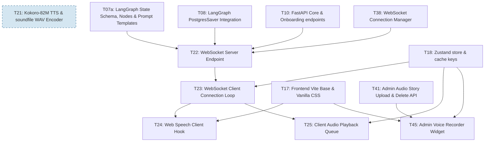

# Phase 6: Audio Speech & Real-Time Communications

## Phase Objective
Configure real-time WebSocket communication, client transcription workflows, and audio playback queues. Note: A 2 to 3 business day schedule buffer is injected between Phase 6 and Phase 7 to perform manual audio latency tuning, handle browser AudioContext state transitions, and verify WebSocket socket leakage under load before final E2E compliance validation.

## Technical Specifications References
* [Backend System Specification](file:///Users/amelton/Library/Mobile%20Documents/com~apple~CloudDocs/estate_agent/specs/specs_backend.md)
* [LangGraph State Machine Specification](file:///Users/amelton/Library/Mobile%20Documents/com~apple~CloudDocs/estate_agent/specs/specs_langgraph.md)
* [UI/UX Component & Layout Specification](file:///Users/amelton/Library/Mobile%20Documents/com~apple~CloudDocs/estate_agent/specs/specs_ui.md)
* [Compliance & Privacy Specification](file:///Users/amelton/Library/Mobile%20Documents/com~apple~CloudDocs/estate_agent/specs/specs_compliance.md)

## Detailed Requirements & Architecture
1. **Kokoro-82M ONNX Text-to-Speech Engine**:
   * The core engine wrapper and WAV PCM_16 encoder are implemented in Phase 2 (Task T21). In Phase 6, we integrate the service into real-time WebSockets.
2. **WebSocket Server Routing**:
   * Build the FastAPI WebSocket route `/api/sessions/{session_id}/ws`.
   * **Framing chunk streams**: Stream sentences generated by the LangGraph dual-brain machine as consecutive `chat_reply_chunk` frames containing text strings, base64 audio byte arrays, and California SB 942 disclosures (`"is_synthetic": true`).
   * **Gate Locks Enforcement**: The WebSocket router must inspect the user's thread state via the Postgres checkpointer saver. If the thread is currently suspended at the `HITL_GUARD` node, reject incoming client message frames and return an error frame of type `error` with message `"Points submission suspended. Your allocations require review and correction by the Executor."` — the socket itself must remain open for status broadcast frames.
3. **Web Speech Client Transcription Hook**:
   * Build a custom `useSpeech` React hook wrapping the HTML5 Web Speech API (`webkitSpeechRecognition`).
   * **Secure context guard**: Verify if served over secure HTTPS (or localhost). Disable the microphone button and show a context warning if served over unsecure HTTP.
   * **Hold vs Toggle mic handlers**:
     * Touch screens: Hold-to-Talk via `touchstart` (activate SpeechRecognition, show pulsing waves) and `touchend`/`touchcancel` (stop transcription and populate the chat text box).
     * Desktop mice: hold-to-talk (mousedown/mouseup) or click-to-toggle (recording persists until next click).
   * **Auto-SilenceTimeout & Async Permission checks**:
     * Wrap all `.start()` and `.stop()` commands in try-catch statements to ignore `InvalidStateError` triggers if user clicks are faster than microphone permissions.
     * Listen to the browser's SpeechRecognition `onend` event to clean up state variables if mobile webviews auto-close recognition.
   * **AudioContext Gesture Unlock**: On mounting `/dashboard`, if the `AudioContext` is `suspended`, the UI must display a subtle volume/speaker button in the header labeled 'Enable Audio'. Tapping this button resumes the AudioContext via `.resume()`. Once resumed, the button is hidden for the session duration. This satisfies the browser requirement that audio playback must be initiated by a user gesture (Frontend Spec §5.5).
4. **Client Audio Playback Queue**:
   * Establish a sequential playlist queue in the client. Add incoming base64 chunks, decode them into browser Blobs, and play them one after another.
   * **Blob URL memory leaks cleanup**: Revoke generated Blob URL object handles (`URL.revokeObjectURL`) upon chunk playback completions. If the user navigates away or unmounts the dashboard, pause any playing audio and revoke all remaining queued Blob URLs.
   * **SB 942 Synthetic Voice Label**: The audio player must parse the `is_synthetic` flag from each WebSocket chunk frame and dynamically update the status label to "Synthesized AI Voice" when synthetic speech is playing. This ownership is consolidated in T25 — T20 must not duplicate this rendering.
5. **Admin Voice Recorder Widget**:
   * Build a dedicated **Voice Story Recording Widget** on the asset staging slide-up card using the browser's `MediaRecorder` API.
   * **Controls**: Record button (starts capture, shows pulsing red ring + elapsed timer `0:15 / 2:00`, max 2 min), Stop button (saves chunks to local Blob), Listen/Playback controls (mini play/pause tracker), Re-do/Delete button, and Save trigger (fires on "Publish Live" click, uploading audio blob via `POST /api/assets/{asset_id}/audio` in parallel with asset metadata).
   * **Secure Context Guard**: `MediaRecorder` requires HTTPS or localhost. Disable the Record button and show a helper message if served over insecure HTTP.
   * **Aesthetics**: Housed in a dedicated panel labeled *"Record Spoken Story / Provenance"* with a thin Sage-Green border and `var(--color-primary-light)` background.

## Phase Checklist & Tasks

### [ ] Task T22: WebSocket Server Endpoint
* **Objective**: Implement the async `/ws` route in `main.py` compiling LangGraph outputs and streaming audio/text chunk frames, integrated with the shared `app/websocket_manager.py` utility singleton class. Enforce gate locks: the WebSocket router must inspect the user's thread state via the Postgres checkpointer saver, and if the thread is currently suspended at the `HITL_GUARD` node, it must reject incoming client message frames and return an error frame of type `error` with message `"Points submission suspended. Your allocations require review and correction by the Executor."` while keeping the socket open for status broadcast frames. **Note: T21 (Kokoro TTS) is a SOFT dependency — T22 MUST be built and tested with text-only WebSocket frames (audio: null) before T21 is complete. Per the T21 graceful degradation contract, the WebSocket server functions correctly with text-only chat when Kokoro is unavailable.** Depends on T07a, T08, T10, and T38.
* **Verification**: Connect a mock client and verify frame logs contain synthetic identifiers. Verify that a thread locked at HITL_GUARD rejects chat message frames (frame-level rejection) while keeping the socket connection alive for status broadcasts. Verify that non-chat frames (e.g., status pings) are not blocked by the HITL_GUARD gate. Verify that text-only WebSocket frames (audio: null) are correctly transmitted and rendered when Kokoro TTS is unavailable.

### [ ] Task T23: WebSocket Client Connection Loop
* **Objective**: Write client-side WebSocket hooks, connection reconnect backoffs, and an offline message queue buffer.
* **Verification**: Verify that disconnecting network buffers typing, and automatically flushes messages once reconnected. Depends on T18 and T22.

### [ ] Task T24: Web Speech Client Hook
* **Objective**: Code the SpeechRecognition hook supporting hold/toggle triggers, HTTPS guards, mobile timeout end events, verifying that the incoming audio frame carries the `is_synthetic` metadata, and implementing the **'Enable Audio' speaker button on dashboard mount** that resumes the suspended AudioContext per Frontend Spec §5.5 (hidden after first successful gesture). Depends on T17 and T23.
* **Verification**: Assert that served over HTTP, the microphone is disabled in the DOM. Verify that synthetic metadata is parsed from WebSocket events. Verify that when AudioContext is suspended on dashboard mount, the 'Enable Audio' button appears and clicking it resumes audio playback. Verify the button is hidden after the first successful gesture.

### [ ] Task T25: Client Audio Playback Queue
* **Objective**: Program the frontend sequential audio playlist, base64 Blob decoder, unmount URL revokers, and confirm that the audio player updates its status label ("Synthesized AI Voice") based on the `is_synthetic` flag in the WebSocket chunk frame. **Note: Consolidated SB 942 synthetic voice label ownership — T25 is the sole owner of dynamic label updates; T20 should not duplicate this rendering.** Depends on T18 and T23.
* **Verification**: Verify chunked audio plays continuously, unmounting cleans up active audio, and the synthetic voice label renders correctly based on the `is_synthetic` flag.

### [ ] Task T45: Admin Voice Recorder Widget
* **Objective**: Build the `MediaRecorder`-based voice story recording widget on the Admin asset staging card. Implement record/stop/playback/redo controls, a 2-minute max duration timer, and the Save trigger that uploads the audio blob via `POST /api/assets/{asset_id}/audio`. Add HTTPS guard disabling the Record button over insecure HTTP. Depends on T17, T18, and T41.
* **Verification**: Start a recording and verify the pulsing timer renders. Stop and verify the local Blob URL is generated for playback. Click Re-do and verify the recording resets. Publish and verify the audio blob is POSTed to the backend and `audio_uri` is updated on the asset.

## Phase Dependency Graph

