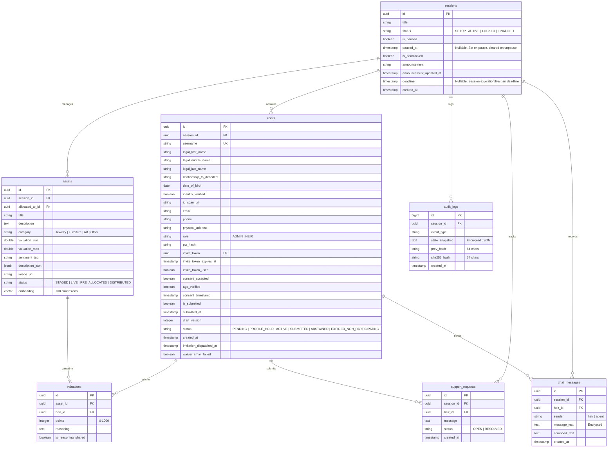

# Estate Steward: Database Schema & Transaction Specification (v2.0)

This specification defines the relational database architecture, table schemas, columns, constraints, indexing strategies (including pgvector), SQLAlchemy relations, transparent field-level encryption, and pessimistic concurrency controls.

---

## 1. Entity-Relationship Model



---

## 2. Table Schemas & Constraints

### 2.1 `sessions` Table
Tracks estate mediation sessions and their operational locks.
*   `id`: `UUID4` (Primary Key, default: `gen_random_uuid()`).
*   `title`: `VARCHAR(100)` (Not Null).
*   `status`: `VARCHAR(20)` (Not Null, Default: `'SETUP'`, Checked Constraint: `status IN ('SETUP', 'ACTIVE', 'LOCKED', 'FINALIZED')`).
*   `is_paused`: `BOOLEAN` (Not Null, Default: `false`).
*   `paused_at`: `TIMESTAMP` (Nullable). Records the exact UTC timestamp when the session was paused, enabling pause duration calculations for token extensions.
*   `is_deadlocked`: `BOOLEAN` (Not Null, Default: `false`).
*   `announcement`: `TEXT` (Nullable). Stores custom, estate-specific announcements written by the Executor to alert heirs immediately upon login.
*   `announcement_updated_at`: `TIMESTAMP` (Nullable). Records the exact UTC timestamp when the announcement was last modified or cleared.
*   `deadline`: `TIMESTAMP` (Nullable). Session expiration/lifespan deadline, default 14 days from active session launch.
*   `created_at`: `TIMESTAMP` (Not Null, Default: `timezone('utc'::text, now())`).

### 2.2 `users` Table
Stores login credentials, session associations, and single-use invitation tokens.
*   `id`: `UUID4` (Primary Key, default: `gen_random_uuid()`).
*   `session_id`: `UUID4` (Foreign Key $\rightarrow$ `sessions.id`, ON DELETE SET NULL, Nullable). Link to active estate session (not null for heirs).
*   `username`: `VARCHAR(100)` (Index, Not Null). Heir usernames correspond to display names (used in app chat and general UI). Unique in combination with `session_id`. During GDPR soft anonymization, this field is overwritten with `"Anonymized Beneficiary [UUID]"` (59 characters).
*   `legal_first_name`: `VARCHAR(50)` (Nullable for Admin, Not Null for Heir). Heir's official legal first name matching will and court documents. Overwritten with `"Anonymized"` during soft anonymization.
*   `legal_middle_name`: `VARCHAR(50)` (Nullable). Heir's official legal middle name. Overwritten with `NULL` during soft anonymization.
*   `legal_last_name`: `VARCHAR(100)` (Nullable for Admin, Not Null for Heir). Heir's official legal last name. Overwritten with `"Beneficiary [UUID]"` during soft anonymization.
*   `relationship_to_decedent`: `VARCHAR(50)` (Nullable). Heir's familial or personal relation to the decedent (e.g. Spouse, Son, Sibling, Friend). Overwritten with `NULL` during soft anonymization.
*   `date_of_birth`: `DATE` (Nullable). Heir's date of birth, used for legal age-verification audits. Overwritten with `NULL` during soft anonymization.
*   `identity_verified`: `BOOLEAN` (Not Null, Default: `false`). Set to `true` once the Executor visually inspects and approves the uploaded ID document matching this profile.
*   `id_scan_uri`: `VARCHAR(255)` (Nullable). File path to the uploaded, encrypted image of the Heir's ID document. **Privacy Constraint**: This file is deleted immediately and this column set to `NULL` once `identity_verified` is toggled to `true`.
*   `role`: `VARCHAR(10)` (Not Null, Checked Constraint: `role IN ('ADMIN', 'HEIR')`).
*   `pw_hash`: `VARCHAR(255)` (Nullable). Argon2 hash for Admin credentials. Left null for token-based Heirs. Overwritten with `NULL` during soft anonymization.
*   `email`: `VARCHAR(255)` (Nullable). Registered email address for notifications and reports. Overwritten with `NULL` during soft anonymization.
*   `phone`: `VARCHAR(20)` (Nullable). Registered phone number for Executor contact. Overwritten with `NULL` during soft anonymization.
*   `physical_address`: `TEXT` (Nullable). Physical mailing address of the Heir, used for paper service of notices and delivery/pickup of physical items. Overwritten with `NULL` during soft anonymization.
*   `invite_token`: `UUID` (Unique, Nullable). Generated UUID for heir invitation dispatch. Overwritten with `NULL` during soft anonymization.
*   `invite_token_expires_at`: `TIMESTAMP` (Nullable). Expiration limit for the token (configurable notice window, default 14 days from creation).
*   `invite_token_used`: `BOOLEAN` (Not Null, Default: `false`). Set to `true` when Heir accepts the invite.
*   `consent_accepted`: `BOOLEAN` (Not Null, Default: `false`). Records if the Heir agreed to terms (GDPR/CCPA privacy, E-SIGN disclosures, and scrubbing consent).
*   `age_verified`: `BOOLEAN` (Not Null, Default: `false`). Records if the Heir verified they are 18+ or have guardian consent.
*   `consent_timestamp`: `TIMESTAMP` (Nullable). Records the exact UTC timestamp when the Heir accepted the consent agreement.
*   `is_submitted`: `BOOLEAN` (Not Null, Default: `false`). Records if the Heir has finalized and submitted their 1000 point allocations.
*   `submitted_at`: `TIMESTAMP` (Nullable). Records the exact UTC timestamp when the Heir finalized and submitted their points. Overwritten with `NULL` during soft anonymization. Used to audit timing and resolve mathematical ties deterministically.
*   `draft_version`: `INTEGER` (Not Null, Default: `0`). Incremental client-side version number checked upon saving draft points to prevent out-of-order race condition updates.
*   `status`: `VARCHAR(30)` (Not Null, Default: `'PENDING'`, Checked Constraint: `status IN ('PENDING', 'PROFILE_HOLD', 'ACTIVE', 'SUBMITTED', 'ABSTAINED', 'EXPIRED_NON_PARTICIPATING')`). Indicates the participation lifecycle state of the user. PROFILE_HOLD blocks submissions while legal details are under Executor review.
*   `created_at`: `TIMESTAMP` (Not Null, Default: `timezone('utc'::text, now())`). Records the exact UTC timestamp when the user profile was created.
*   `invitation_dispatched_at`: `TIMESTAMP` (Nullable). Records the exact UTC timestamp when the invitation email was successfully dispatched.
*   `waiver_email_failed`: `BOOLEAN` (Not Null, Default: `false`). Set to `true` if the E-SIGN/UETA waiver confirmation email fails to deliver, triggering a warning in the Admin console. Retained as-is (non-PII boolean flag) during soft anonymization.

### 2.3 `assets` Table
Stores the estate inventory metadata, images, and visual vector embeddings.
*   `id`: `UUID4` (Primary Key, default: `gen_random_uuid()`).
*   `session_id`: `UUID4` (Foreign Key $\rightarrow$ `sessions.id`, ON DELETE CASCADE, Not Null).
*   `title`: `VARCHAR(150)` (Nullable). Staging uploads can temporarily leave this null until OCR completes.
*   `description`: `TEXT` (Nullable). Detailed description of the asset.
*   `category`: `VARCHAR(20)` (Nullable, Checked Constraint: `category IN ('Jewelry', 'Furniture', 'Art', 'Other')`).
*   `valuation_min`: `DOUBLE PRECISION` (Nullable). Minimum estimated monetary value.
*   `valuation_max`: `DOUBLE PRECISION` (Nullable). Maximum estimated monetary value.
*   `valuation_source`: `VARCHAR(150)` (Nullable). Explains the source of the appraisal range (e.g. 'Professional Appraisal', 'Tax Assessment').
*   `sentiment_tag`: `VARCHAR(255)` (Nullable). Sentimental tag/description.
*   `description_json`: `JSONB` (Nullable). Stores dynamic dictionary attributes extracted by OCR (e.g. `{"color": "mahogany", "dimensions": "3ft x 6ft", "estimated_age": "antique"}`).
*   `image_uri`: `VARCHAR(255)` (Not Null). File path or URL to the WebP thumbnail.
*   `audio_uri`: `VARCHAR(255)` (Nullable). File path to the uploaded WebM/MP3 audio recording of the Admin telling the asset story.
*   `ocr_status`: `VARCHAR(15)` (Nullable, Checked Constraint: `ocr_status IN ('PROCESSING', 'COMPLETED', 'FAILED')`). Tracks background Llava OCR processing state on staged assets.
*   `status`: `VARCHAR(20)` (Not Null, Default: `'STAGED'`, Checked Constraint: `status IN ('STAGED', 'LIVE', 'PRE_ALLOCATED', 'DISTRIBUTED')`).
*   `allocated_to_id`: `UUID` (Foreign Key $\rightarrow$ `users.id`, ON DELETE SET NULL, Nullable). Stores the heir ID that is awarded this asset upon finalization. **Checked Constraint**: `CHECK (status NOT IN ('PRE_ALLOCATED', 'DISTRIBUTED') OR allocated_to_id IS NOT NULL)` ensures a target beneficiary is always defined for pre-allocated or distributed assets.
*   `embedding`: `VECTOR(768)` (Nullable). Stores the 768-dimensional visual-semantic vector output from the `nomic-embed-text` inference engine.
    *   **Coupling Constraint**: The dimension size is strictly tied to the active `EMBEDDING_MODEL` config. If the model is switched (e.g., to a model outputting 384 or 1536 dimensions), the database schema must be migrated to match the new model's output vector size to prevent database insert crashes.
*   **Asset Lifecycle Guard**: While database columns are nullable to support asynchronous background OCR during the `STAGED` phase, the application gateway MUST validate that `title`, `description`, `category`, `valuation_min`, `valuation_max`, `valuation_source`, and `sentiment_tag` are fully populated and valid before allowing the Admin to transition the asset's `status` to `'LIVE'` or `'PRE_ALLOCATED'` (`POST /api/assets/{asset_id}/publish`).


### 2.4 `valuations` Table
Stores points allocations and justification details for each asset per heir.
*   `id`: `UUID4` (Primary Key, default: `gen_random_uuid()`).
*   `asset_id`: `UUID4` (Foreign Key $\rightarrow$ `assets.id`, ON DELETE CASCADE, Not Null).
*   `heir_id`: `UUID4` (Foreign Key $\rightarrow$ `users.id`, ON DELETE CASCADE, Not Null).
*   `points`: `INTEGER` (Not Null, Checked Constraint: `points >= 0 AND points <= 1000`).
*   `reasoning`: `TEXT` (Nullable). Sentimental context written by the Heir.
*   `is_reasoning_shared`: `BOOLEAN` (Not Null, Default: `false`). If `true`, the `reasoning` text is visible to other heirs on the asset's detail page, while the numeric `points` value remains strictly private during the active session.
*   **Unique Index**: A unique composite constraint `uq_asset_heir` is defined on `(asset_id, heir_id)` to ensure each Heir has at most one allocation entry per asset.
*   **Valuation Matrix Seeding Contract**:
    To prevent math execution errors in the `fairpyx` solver due to incomplete preferences matrices:
    1.  **On Asset Publication**: When a staged asset transitions to `'LIVE'` (`POST /api/assets/{asset_id}/publish`), the database transaction must insert a default `0`-point valuation row for all currently active/verified Heirs in that session (those with `status` not in `('PENDING', 'PROFILE_HOLD', 'EXPIRED_NON_PARTICIPATING')`). If the asset transitions directly to `'PRE_ALLOCATED'`, no valuation rows are created.
    2.  **On Heir Identity Approval**: When the Executor approves an Heir's identity (`POST /api/heirs/{heir_id}/verify-identity` with `action = "approve"`), transitioning them from `'PROFILE_HOLD'` to `'ACTIVE'`, the database transaction must query all existing `'LIVE'` assets in the session (excluding `'PRE_ALLOCATED'` assets) and insert a default `0`-point valuation row for this newly-active Heir. **This must NOT be triggered at `POST /api/invite/verify`**, because at that point the Heir's status is `'PROFILE_HOLD'` — which is excluded from the seeding eligibility criteria in rule 1 above (which explicitly excludes `'PROFILE_HOLD'`), and would violate the contract and potentially trigger unique constraint violations on a second seeding pass at approval.
    3.  **On Asset Pre-Allocation**: If an asset that was previously published as `'LIVE'` (which has seeded `0`-point valuations in the database) is transitioned to `'PRE_ALLOCATED'` (`POST /api/assets/{asset_id}/pre-allocate`), the database transaction must explicitly delete all existing valuation rows for that asset in the `valuations` table to prevent orphaned valuations from polluting the solver matrix.
    4.  **Conflict Avoidance**: All default valuation insertions must utilize an `ON CONFLICT (asset_id, heir_id) DO NOTHING` or upsert clause to prevent database unique constraint crashes.
    5.  This ensures that every Heir always has exactly one row in the `valuations` table for every published active asset, providing a fully populated matrix (no missing cells) for both the frontend stores and the backend math solver. `'PRE_ALLOCATED'` assets are omitted from the matrix completely.

### 2.5 `audit_logs` Table
A tamper-proof ledger of all state modifications (valuation submission, Admin override).
*   `id`: `BIGSERIAL` (Primary Key).
*   `session_id`: `UUID4` (Foreign Key $\rightarrow$ `sessions.id`, ON DELETE CASCADE, Not Null).
*   `event_type`: `VARCHAR(50)` (Not Null, e.g., `'VALUATION_SUBMIT'`, `'ADMIN_OVERRIDE'`, `'SESSION_FINALIZED'`, `'USER_PROFILE_UPDATE'`).
*   `state_snapshot`: `TEXT` (Not Null). An encrypted JSON string capturing the relevant state at the time of the event (e.g., the valuations table dump for submissions, or the changed fields diff for profile updates), encrypted at rest using AES-Fernet.
*   `prev_hash`: `CHAR(64)` (Not Null). The SHA-256 hash of the immediately preceding audit log row for this session. For the session's genesis record, this is set to `"0" * 64`.
*   `sha256_hash`: `CHAR(64)` (Not Null). The SHA-256 hash computed over the colon-delimited string serialization using a PII-scrubbed state snapshot: `f"{id}:{event_type}:{scrubbed_state_snapshot_json}:{prev_hash}"`.
    *   **Cryptographic Stability Contract**: To prevent historical GDPR Article 17 account erasures (which anonymize PII in the `state_snapshot` column) from breaking the hash chain, the hash calculation is performed on the PII-scrubbed JSON string where sensitive details are replaced by `"Anonymized"`.
    *   **Pre-fetching Contract**: Because `sha256_hash` is `NOT NULL` and requires the generated primary key `id` for computation, the application must query the next sequence value via `SELECT nextval('audit_logs_id_seq')` to pre-determine the row `id` in Python before calculating the hash and executing the database insert.
*   `created_at`: `TIMESTAMP` (Not Null, Default: `timezone('utc'::text, now())`). Records the exact UTC timestamp when the audit event was logged. Required by the Final Distribution & Probate Audit Ledger PDF for rendering event timestamps in the Admin Intervention Log and Proof of Notice Log sections.

### 2.6 `support_requests` Table
Tracks user assistance tickets and deadlock resolution pauses.
*   `id`: `UUID4` (Primary Key, default: `gen_random_uuid()`).
*   `session_id`: `UUID4` (Foreign Key $\rightarrow$ `sessions.id`, ON DELETE CASCADE, Not Null).
*   `heir_id`: `UUID4` (Foreign Key $\rightarrow$ `users.id`, ON DELETE CASCADE, Not Null).
*   `message`: `TEXT` (Not Null).
*   `status`: `VARCHAR(10)` (Not Null, Checked Constraint: `status IN ('OPEN', 'RESOLVED')`, Default: `'OPEN'`).
*   `created_at`: `TIMESTAMP` (Not Null, Default: `timezone('utc'::text, now())`).

### 2.7 `chat_messages` Table
Persists the conversation logs between heirs and the Mediator agent.
*   `id`: `UUID4` (Primary Key, default: `gen_random_uuid()`).
*   `session_id`: `UUID4` (Foreign Key $\rightarrow$ `sessions.id`, ON DELETE CASCADE, Not Null).
*   `heir_id`: `UUID4` (Foreign Key $\rightarrow$ `users.id`, ON DELETE CASCADE, Not Null).
*   `sender`: `VARCHAR(10)` (Not Null, Checked Constraint: `sender IN ('heir', 'agent')`).
*   `message_text`: `TEXT` (Not Null). Raw chat text encrypted at rest using AES-Fernet JSON/text decorator to protect personal sentiments.
*   `scrubbed_text`: `TEXT` (Not Null). Safe, PII-scrubbed text used for search and model history compilation.
*   `created_at`: `TIMESTAMP` (Not Null, Default: `timezone('utc'::text, now())`).

### 2.8 `custom_faqs` Table
Stores custom, estate-specific guidelines and FAQs written by the Admin.
*   `id`: `UUID4` (Primary Key, default: `gen_random_uuid()`).
*   `session_id`: `UUID4` (Foreign Key $\rightarrow$ `sessions.id`, ON DELETE CASCADE, Not Null).
*   `question`: `TEXT` (Not Null).
*   `answer`: `TEXT` (Not Null).
*   `created_at`: `TIMESTAMP` (Not Null, Default: `timezone('utc'::text, now())`).

---

## 3. Indexing Strategy & Vector Distance Operator

1.  **B-Tree Indexes**:
    *   Unique Index on `users(session_id, username)`.
    *   Unique Index on `users(invite_token)` where token is not null.
    *   Foreign Key Indexes: `users(session_id)`, `assets(session_id)`, `assets(allocated_to_id)`, `valuations(asset_id)`, `valuations(heir_id)`, `support_requests(session_id)`, `support_requests(heir_id)`, `audit_logs(session_id)`, `chat_messages(session_id)`, `chat_messages(heir_id)`.
2.  **pgvector Vector Similarity Index**:
    To accelerate semantic/hybrid vector queries, we configure an HNSW (Hierarchical Navigable Small World) index on the `embedding` column using cosine distance operators:
    ```sql
    CREATE INDEX assets_embedding_hnsw_idx 
    ON assets 
    USING hnsw (embedding vector_cosine_ops);
    ```
    This matches queries via cosine similarity: `1 - (embedding <=> :query_vector)`.

---

## 4. Transaction Isolation & Concurrency Contracts

### 4.1 Pessimistic Read/Write Locks
When an Heir triggers a final valuation submission (`POST /api/valuations/submit`), the backend must query and lock the session status, the Heir's user record, and the Heir's existing valuations. We use a pessimistic read-for-update lock to prevent concurrent modifications (such as another executor override or simultaneous API requests) from corrupting the transaction:

##### Strict Locking Order Contract
To prevent database deadlock exceptions (circular lock dependencies) when concurrent writes occur across multiple tables, the application must acquire pessimistic locks in a strict top-down dependency hierarchy:
1. **First**: Lock the matching session record in `sessions` (by `id`). The lock mode is determined as follows:
    *   **Shared Read Lock (`FOR SHARE`)**: Used ONLY by read-only and draft-saving endpoints (e.g., `PUT .../valuations/draft`) that validate status but do not modify the state snapshot audit ledger.
    *   **Exclusive Lock (`FOR UPDATE`)**: Required by all endpoints that write to the `sessions` row (e.g., `POST .../pause`, `POST .../finalize`, `POST .../launch`) AND all endpoints that log events to the `audit_logs` table (e.g., final submissions `POST .../valuations/submit`, profile updates `PUT .../heirs/me/profile`, and active abstention `POST .../heirs/me/abstain`). Acquiring an exclusive lock on the Session record serializes concurrent audit log calculations for that session, preventing duplicate `prev_hash` assignments and audit log forks.
2. **Second**: Lock the matching user record in `users` (by `id`) with an exclusive write lock.
3. **Third**: Lock the related point rows in `valuations` (by `heir_id`) with an exclusive write lock.

```python
# FastAPI Endpoint database isolation transaction (concurrency-serialized for audit logging):
with db.begin():
    # 1. Lock Session row first (using exclusive lock to serialize audit log generation)
    session = db.query(Session).filter(Session.id == session_id).with_for_update().first()
    
    # 2. Lock User status second (exclusive lock for user records)
    user = db.query(User).filter(User.id == current_heir_id).with_for_update().first()
    
    # 3. Lock Valuations third (exclusive lock for specific heir valuations)
    locked_valuations = db.query(Valuation).filter(
        Valuation.heir_id == current_heir_id
    ).with_for_update(of=Valuation).all()
    
    # Run sum verification (must equal exactly 1000)
    # ...
    # Commit changes and write audit log
```

---

## 5. Transparent Cryptographic Field Decoration

SQLAlchemy models use a custom `TypeDecorator` to transparently encrypt and decrypt sensitive columns at rest. Per the Compliance Spec (Section 1.2), the `EncryptedJSON` decorator **must be applied to all three of the following columns**:

| Table | Column | Content Type |
| :--- | :--- | :--- |
| `audit_logs` | `state_snapshot` | Encrypted JSON string of state changes. |
| `chat_messages` | `message_text` | Raw heir chat text containing potential PII and family sentiments. |
| `valuations` | `reasoning` | Heir's sentimental justification text for each asset allocation. |

> [!IMPORTANT]
> `chat_messages.scrubbed_text` is **not encrypted** — it is the PII-redacted version stored in plaintext for LLM context retrieval and RAG queries. Only the raw `message_text` is encrypted.


```python
import os
import json
from cryptography.fernet import Fernet
from sqlalchemy.types import TypeDecorator, Text

class EncryptedJSON(TypeDecorator):
    impl = Text

    def __init__(self, *args, **kwargs):
        super().__init__(*args, **kwargs)
        # Load Fernet key from Environment
        key = os.environ.get("ENCRYPTION_KEY")
        if not key:
            raise ValueError("ENCRYPTION_KEY environment variable is not set.")
        self.fernet = Fernet(key.encode())

    def process_bind_param(self, value, dialect):
        if value is None:
            return None
        # Serialize and encrypt
        serialized = json.dumps(value)
        return self.fernet.encrypt(serialized.encode()).decode()

    def process_result_value(self, value, dialect):
        if value is None:
            return None
        # Decrypt and deserialize
        decrypted = self.fernet.decrypt(value.encode()).decode()
        return json.loads(decrypted)
```

---

## 6. Schema Migration & Maintenance

All structural updates are handled via **Alembic** migration scripts:
1.  **Alembic Initialization**: Base migration loads the `pgvector` extension:
    ```sql
    CREATE EXTENSION IF NOT EXISTS vector;
    ```
2.  **Schema Enforcement**: Column nullability, composite unique bounds (`uq_asset_heir`), and checklist constraints must be declared natively in SQLAlchemy models and validated on Alembic generation.
3.  **Database Connection Startup Retry Loop**:
    To prevent container startup crash loops where the FastAPI app boots before the PostgreSQL database is ready to accept connections:
    *   The database engine initialization code in `app/database.py` must execute within a retry block.
    *   It must attempt to establish a database connection up to 5 times with a 2-second delay between attempts.
    *   The app should only execute pgvector initialization and SQLAlchemy schema creation once a database socket connection is successfully verified.

---

## 7. Data Safety & Redundancy Strategy
To ensure that local hardware crashes (such as SD card or SSD failure on the host Raspberry Pi 5) do not cause permanent loss of estate records:
*   **Database Volume Persistence**: The PostgreSQL database data directory `/var/lib/postgresql/data` is mapped to a persistent, named Docker volume (`pgdata`). This decouples the database file lifecycle from the database container execution lifecycle.
*   **Media Volume Persistence**: The local static uploads directory `/app/static/uploads` is mapped to a persistent, named Docker volume (`uploads_data`) and shared as a read-only mount to Nginx. This prevents uploaded asset images from being deleted during container updates or app restarts.
*   **Encrypted Database Snapshots**: System backups generated via `/api/system/backup` use standard `pg_dump` tools to output table schemas and row contents. The SQL output is encrypted using the application's symmetric AES-Fernet key (derived from the `ENCRYPTION_KEY` environment variable or the offline 24-word **Paper Recovery Key**) prior to download. This guarantees that backup files stored on external drives or sent over local networks protect sensitive information (PII, values, family sentiments) from unauthorized extraction.
*   **Physical Records Redundancy**: The platform forces page templates and `@media print` CSS configurations to allow the Executor to print hard copies of the finalized distribution audit ledger and keepsake books, establishing a permanent paper trail for the probate court in case of catastrophic storage loss.
