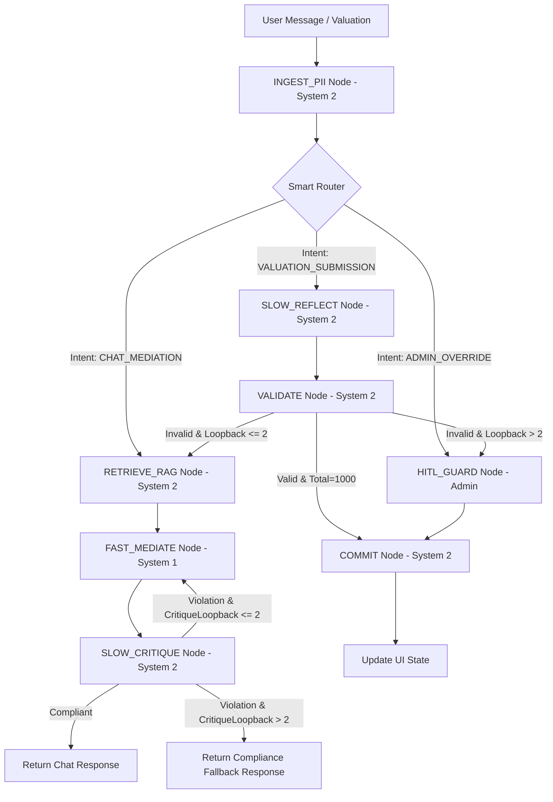

# Estate Steward: LangGraph State Machine Specification (v1.0)

This specification defines the LangGraph state machine structure, state variables, operational nodes, routing logic, speech-to-text integration, and Human-in-the-Loop (HITL) interrupt flows.

It acts as a companion document to [specs_backend.md](file:///Users/amelton/Library/Mobile%20Documents/com~apple~CloudDocs/estate_agent/specs/specs_backend.md).

---

## 1. State Machine Philosophy

To support a grief-informed mediation process, we use a Kahneman-inspired **System 1 / System 2** flow:
*   **System 1 (Fast Thinker - `FAST_MEDIATE_NODE`)**: Real-time, low-latency conversational active listening. It maintains the emotional "holding space" but is strictly forbidden from making financial or point allocation decisions.
*   **System 2 (Slow Thinker - `SLOW_REFLECT_NODE` & `VALIDATE_NODE`)**: Asynchronous, high-reasoning validation. Executes RAG query checks, evaluates mathematical fairness constraints, and controls state updates.

---

## 2. Graph State & Schema Contract

The state of the mediation session is managed via a shared `MediationState` context (defined as a `TypedDict` in python):

```python
import operator
from typing import List, Annotated, TypedDict, Optional, Dict
from pydantic import BaseModel, Field

class SharedMemorySchema(BaseModel):
    heir_username: str
    reasoning: str

class AssetSchema(BaseModel):
    id: str
    session_id: str
    title: str = Field(..., max_length=150)
    description: str
    category: str = Field(..., pattern="^(Jewelry|Furniture|Art|Other)$")
    valuation_min: float
    valuation_max: float
    valuation_source: Optional[str] = None
    sentiment_tag: str
    image_uri: str
    audio_uri: Optional[str] = None
    status: str = Field(..., pattern="^(STAGED|LIVE|PRE_ALLOCATED|DISTRIBUTED)$")
    ocr_status: Optional[str] = Field(None, pattern="^(PROCESSING|COMPLETED|FAILED)$")
    description_json: Optional[Dict[str, str]] = None
    allocated_to_id: Optional[str] = None
    shared_memories: List[SharedMemorySchema] = []

class ValuationSchema(BaseModel):
    asset_id: str
    heir_id: str
    points: int = Field(..., ge=0, le=1000)
    reasoning: Optional[str] = None
    is_reasoning_shared: bool = False

class MediationState(TypedDict):
    session_id: str
    heir_id: str
    input_text: str
    scrubbed_text: str
    retrieved_context: Optional[str]   # Textual RAG context populated dynamically by matching query
    assets: Annotated[List[AssetSchema], operator.add]
    valuations: List[ValuationSchema]
    chat_history: List[Dict[str, str]]  # Contains only scrubbed chat history logs: {"sender": "heir"|"agent", "text": str}
    is_paused: bool
    is_deadlocked: bool
    audit_trail: List[str]
    loopback_count: int
    critique_loopback_count: int
    correction_instruction: Optional[str]  # Instructions from System 2 to System 1
```

---

## 3. Operational Workflow Graph

The following Mermaid graph visualizes the path of an heir's message or valuation submission through the system nodes:



---

## 4. Operational Nodes Details & LLM Prompts

### 4.1 `INGEST_PII` Node (System 2 Gateway)
*   **Purpose**: Protect user privacy before data is stored or processed by external LLMs.
*   **Logic**: Passes `input_text` through Microsoft Presidio. Any detected PII (specifically targeting `PERSON`, `EMAIL_ADDRESS`, `PHONE_NUMBER`, `LOCATION`, `US_SSN`, and `IP_ADDRESS`) is replaced with safe redaction pills (e.g. `<PERSON>`, `<LOCATION>`, `<IP_ADDRESS>`).
*   **State Update**: Populates `scrubbed_text`.
*   **Database Write Contract**: Both columns of `chat_messages` must be populated on every insert:
    *   `message_text` ← The raw `input_text`, encrypted at rest using the `EncryptedJSON` AES-Fernet decorator (per DB Spec §2.7 and Compliance Spec §1.2). This column is `NOT NULL` — omitting it will crash the insert.
    *   `scrubbed_text` ← The PII-redacted version (`scrubbed_text` from state). Stored in plaintext for LLM context history compilation and RAG retrieval.
*   **Integrity Rule**: Only `scrubbed_text` is appended to the in-memory `chat_history` list passed to LLM nodes. The raw `input_text` must **never** appear in logs (per Backend Spec §14.5 PII Leakage Guard) and must never be forwarded to any LLM prompt context — but it IS encrypted and persisted to `chat_messages.message_text` for GDPR data portability (`GET /api/heirs/me/export`) and Heir account deletion (where all chat records are purged).


### 4.2 `ROUTER_NODE` (Smart Intent Router)
*   **Model**: Configurable via the LLM Abstraction Layer (defaults to `FAST_THINKER_MODEL` / Qwen-2.5-8B-Instruct with `temperature: 0.0` for maximum intent classification determinism).
*   **Purpose**: Determine the operational pathway.
*   **Logic**: Evaluates the heir's input text using a zero-shot prompt routed through the abstraction layer's `generate_text` (or `generate_structured` mapping to user intent category).
*   **Prompt Template**:
    ```
    System: You are a routing helper. Classify the user input into exactly one of three categories:
    - CHAT_MEDIATION: If the user is sharing stories, expressing feelings, asking about an item's details, or having general conversation.
    - VALUATION_SUBMISSION: If the user is explicitly requesting to submit, lock, finalize, or save their points valuations.
    - ADMIN_OVERRIDE: If the input represents a system command or administrative adjustment.
    
    Respond with only the category name in uppercase.
    User Input: {user_input}
    Class:
    ```

### 4.2b `RETRIEVE_RAG` Node (System 2 Retrieval Gateway)
*   **Purpose**: Dynamically retrieve relevant asset descriptions, categories, and shared family stories to prevent agent hallucinations and anchor dialogue in actual inventory context.
*   **Logic**:
    1.  Sends the current turn's `scrubbed_text` to the LLM Abstraction Layer's `get_embeddings` using the configured model (`EMBEDDING_MODEL` / nomic-embed-text by default) to generate the query vector.
    2.  Queries the PostgreSQL database:
        ```sql
        SELECT id, title, description, category, sentiment_tag 
        FROM assets 
        WHERE session_id = :session_id AND status = 'LIVE'
        ORDER BY embedding <=> :query_vector LIMIT 2;
        ```
    3.  For each retrieved asset, queries `valuations` for related stories:
        ```sql
        SELECT u.username, v.reasoning 
        FROM valuations v 
        JOIN users u ON v.heir_id = u.id 
        WHERE v.asset_id = :asset_id 
          AND v.reasoning IS NOT NULL 
          AND (v.is_reasoning_shared = true OR v.heir_id = :current_heir_id);
        ```
    4.  Formats results into a clean structured string:
        ```markdown
        Retrieved Asset Context:
        - Asset: [Title] (Category: [Category])
          Description: [Description]
          Sentiment: [Sentiment Tag]
          Family Memories:
            * [Username]: "[Reasoning]"
        ```
        If no assets meet the similarity threshold ($\ge 75\%$), sets `retrieved_context = "No specific asset matches found in query."`.
    5.  Saves the formatted text to `retrieved_context` in the state.

### 4.3 `FAST_MEDIATE_NODE` (System 1 Conversation)
*   **Model**: Configurable via the LLM Abstraction Layer (defaults to `FAST_THINKER_MODEL` / Qwen-2.5-8B-Instruct with `temperature: 0.5` to balance active listening warmth with strict rule-following).
*   **Purpose**: Deliver low-latency empathic active listening.
*   **Logic**: Generates support replies acknowledging the heir's statements, keeping responses soft, grounded, and contextually informed of the discussed asset. The request is routed via the abstraction layer's `generate_text`.
*   **System Prompt & Rules**:
    ```
    System: You are an empathic, active-listening estate mediator helping an heir process their grief and thoughts about family assets.
    CRITICAL RULES:
    1. You MUST speak with warmth, empathy, and respect. Acknowledge and validate their emotional statements.
    2. You are FORBIDDEN from making ownership promises, dividing items, or confirming who gets what.
    3. You are FORBIDDEN from doing points calculation math or altering allocations yourself.
    4. Keep replies concise (under 4 sentences) to support a clean mobile chat interface.
    5. If the heir is discussing a specific family asset, reference the details and family memories in the Retrieved Asset Context below to show active listening and build empathy (e.g. acknowledging stories shared by other family members without revealing their point allocations).
    6. If a correction instruction is provided in the context, gently weave it into your dialogue to help the heir align their allocations, maintaining a supportive tone.
    
    Correction Instruction: {correction_instruction}
    Retrieved Asset Context: {retrieved_context}
    Chat History: {chat_history}
    User Input: {scrubbed_text}
    Response:
    ```

### 4.4 `SLOW_CRITIQUE_NODE` (System 2 Chat Audit)
*   **Model**: Configurable via the LLM Abstraction Layer (defaults to `SLOW_THINKER_MODEL` / Qwen-2.5-14B-Instruct with `temperature: 0.0` to maximize safety audit determinism).
*   **Purpose**: Audit Mediator agent responses for boundary compliance before sending them to the user.
*   **Logic**:
    1. Runs a compliance critique check synchronously on the fully generated `FAST_MEDIATE_NODE` output text (restricted to <4 sentences to keep latency low) to ensure it does not contain promise-making or mathematical commitments. The query uses `generate_structured` via the LLM Abstraction Layer to enforce the JSON output structure.
    2. **Compliant Path**: If `violation == false`, persists the scrubbed dialogue text to the database's `chat_messages` table, resets `critique_loopback_count = 0`, and streams the completed text sentence chunks and synthesizes the audio chunks sequentially via Kokoro-82M, sending them as WebSocket frames.
    3. **Violation Regeneration Path**: If `violation == true` and the state's `critique_loopback_count <= 2`:
       * Increments `critique_loopback_count` by `1`.
       * Writes the audit `reason` into the `correction_instruction` field.
       * Routes execution directly back to `FAST_MEDIATE_NODE` to regenerate the response with the compliance feedback.
    4. **Violation Fallback Path**: If `violation == true` and `critique_loopback_count > 2`:
       * Persists a warm compliance fallback message to `chat_messages` as the Mediator's response:
         *"I am here to listen and help you catalog your feelings and stories about the estate, but I cannot promise ownership or make financial allocations. Let's focus on what this keepsake means to you."*
       * Resets `critique_loopback_count = 0` and streams the fallback message chunks and synthesizes the fallback audio chunks sequentially over WebSockets.
*   **System Prompt (Critique Node)**:
    ```
    System: You are a strict compliance auditor checking a mediation chat session for rule violations.
    VIOLATION CRITERIA:
    - Did the mediator promise a specific asset to the heir? (e.g. "You will definitely get the grandfather clock")
    - Did the mediator make any financial commitments or calculations?
    
    Review the latest interaction:
    Mediator Response: {mediator_response}
    
    Output a JSON block:
    {{
      "violation": true/false,
      "reason": "description of violation if any, otherwise empty"
    }}
    ```

### 4.4b `SLOW_REFLECT_NODE` (System 2 Valuation Audit)
*   **Model**: Configurable via the LLM Abstraction Layer (defaults to `SLOW_THINKER_MODEL` / Qwen-2.5-14B-Instruct with `temperature: 0.0` for auditing consistency).
*   **Purpose**: Audit valuations against user sentiment and format preference lists for math division solver.
*   **Logic**:
    1.  Validates that the sentiments expressed by the heir in their scrubbed chat logs match their submitted points valuations via the LLM Abstraction Layer.
    2.  Prepares and structures the preferences matrix dictionary for the `fairpyx` division solver.
    3.  Passes execution directly to `VALIDATE_NODE`.


### 4.5 `VALIDATE_NODE` (Mathematical Constraints)
*   **Purpose**: Ensure strict adherence to allocation limitations for the submitting Heir.
*   **Logic**:
    *   Checks if `Sum(Valuations) == 1000` for the current Heir's allocations.
    *   **Loopback Condition**: If validation fails (sum is not exactly 1000) and `loopback_count <= 2`, increments `loopback_count`, writes a helpful correction instruction into `correction_instruction`, and routes back to `RETRIEVE_RAG_NODE` (not directly to `FAST_MEDIATE_NODE`) so that the Mediator receives a freshly retrieved asset context before generating the guided correction prompt. This matches the authoritative workflow graph in Section 3.
    *   **Escalation Condition**: If validation fails and `loopback_count > 2`, the graph routes to `HITL_GUARD` to notify the Admin of repeated formatting blocks.
    *   **Note on Deadlocks vs. Sum Validation Failures**: Mathematical deadlock checking (e.g. Mutually Exclusive Maximum Priority, Zero-Utility Starvation, and Valuation Parity Conflicts) is **not** performed at the individual Heir node level, as it requires a complete valuations matrix from all heirs. Deadlocks are evaluated exclusively at the session level during Admin finalization (`POST /api/sessions/{session_id}/finalize`). The validation failure occurring at the individual Heir node level is strictly a formatting/sum error (i.e. points do not sum to exactly 1000). While persistent sum validation failures escalate to `HITL_GUARD` (to alert the Admin that the Heir is struggling with allocations), this is a sum formatting hold, not a session-wide mathematical deadlock, and is resolved by correcting the Heir's points, rather than using the Force Allocation console.

### 4.6 `COMMIT_NODE` (Data Persistence & Seal)
*   **Purpose**: Finalize state updates and lock transactions.
*   **Logic**:
    *   Persists validated points values into the Postgres database.
    *   Generates a new entry in `audit_logs`.
    *   Computes the SHA-256 hash chaining link, binding this block to the previous ledger entry.
    *   Sends a WebSocket state update to transition the Heir dashboard to its locked/view-only state.

### 4.7 `HITL_GUARD` (Human-in-the-Loop Executor Console)
*   **Purpose**: Halt progression when conflicts cannot be resolved automatically.
*   **Logic**: Pauses graph execution, logs a deadlock status, and broadcasts alerts to the Admin dashboard.

---

## 5. Voice Transcription Ingestion

To keep server-side workloads lightweight on the local Raspberry Pi compute host:
1. Speech recognition is executed entirely **client-side** on the Heir's browser utilizing the Web Speech API.
2. The transcribed text string is packaged and sent over the session-scoped WebSocket (`/api/sessions/{session_id}/ws`):
   ```json
   {
     "type": "chat_message",
     "text": "transcribed speech string",
     "metadata": {
       "input_method": "voice"
     }
   }
   ```
3. The FastAPI server receives the WebSocket message and passes the text payload into the `INGEST_PII` node of the LangGraph state machine. It is processed identically to a standard typed chat message.

---

## 6. Interrupts & Resumption Workflows

### 6.1 Thread Configurations & Session Tenant Isolation
*   **Thread ID Format**: The LangGraph state machine is compiled using a persistent checkpointer. To support private "shuttle-diplomacy" chats for different heirs in the same estate session, the thread config is isolated per Heir:
    ```python
    # Format of configuration context
    config = {"configurable": {"thread_id": f"{session_id}:{heir_id}"}}
    ```
*   **State Sharing**: The graph state loads the specific Heir's conversation history but references the shared `session_id` to retrieve matching assets.

### 6.2 Manual Pause (Grief Lock)
*   **Trigger**: Admin locks the session or an Heir files a help ticket. Updates `is_paused = True` in Postgres.
*   **Implementation**: Handled at the **FastAPI gateway layer**. Before executing the graph or writing updates, the WebSocket controller inspects the DB. If paused, it halts execution and returns an error frame, preventing graph modifications.

### 6.3 Sum Validation Hold & Resumption (HITL)
*   **Halt**: The graph compiles using a checkpointer (`SqliteSaver` or `PostgresSaver`) and designates an interrupt:
    ```python
    graph = builder.compile(checkpointer=checkpointer, interrupt_before=["HITL_GUARD"])
    ```
*   **Pause State**: When `VALIDATE_NODE` escalates due to persistent sum validation failures (i.e. `loopback_count > 2`), the graph interrupts execution right before `HITL_GUARD` and saves the thread context under the composite thread ID. The thread is flagged as requiring Executor assistance.
*   **Override & Resume**:
    1.  The Admin/Executor contacts the Heir to resolve the points allocation sum discrepancy.
    2.  The Heir or Executor adjusts the draft allocations so they sum to exactly 1000 points.
    3.  The API endpoint updates the valuations and writes the corrected valuations into the checkpointer state:
        ```python
        # Target the paused thread config
        config = {"configurable": {"thread_id": f"{session_id}:{heir_id}"}}
        
        # Write updated valuations directly into the state schema
        graph.update_state(config, {"valuations": corrected_valuations}, as_node="HITL_GUARD")
        
        # Resume execution; graph skips HITL_GUARD and routes to COMMIT_NODE
        for event in graph.stream(None, config):
            process_event(event)
        ```

### 6.4 Loopback Counter Reset Rules
*   The `loopback_count` is incremented during math validation failure inside the `VALIDATE_NODE`.
*   To prevent historical errors from locking the user out of future attempts, the counter is reset to `0` by the state gateway when:
    1.  The graph successfully runs `COMMIT_NODE`, finalising the session state.
    2.  A new points valuation submission request is explicitly triggered by the user clicking "Submit Valuations" on the UI (indicating the user has modified their values on the UI and resubmitted, starting a new validation cycle). The state gateway must reset `loopback_count = 0` and clear the `correction_instruction` field to `None` to prevent stale instructions from leaking into subsequent chat contexts. It is **not** reset on intermediate text-based chat responses within the correction loop, allowing the counter to accumulate and correctly trigger the HITL escalation if they fail validation multiple times in dialogue.

---

## 7. Technical Fault-Tolerance & Self-Healing

To guarantee that network drops, model timeouts, or malformed outputs do not crash the local Raspberry Pi backend:

### 7.1 Built-in Node Retry Policies
We configure LangGraph's prebuilt `RetryPolicy` on all LLM nodes. This handles temporary connection timeouts to the Ollama gateway under high CPU/GPU load:
*   **Target Nodes**: `ROUTER_NODE`, `FAST_MEDIATE_NODE`, `SLOW_CRITIQUE_NODE`, `SLOW_REFLECT_NODE`.
*   **Retry Policy**:
    *   `max_attempts = 3`
    *   `backoff_factor = 2.0` (Exponential backoff starting at 1s, then 2s, then 4s).
    *   `retry_on = (httpx.ConnectTimeout, httpx.ReadTimeout, httpx.HTTPStatusError)`

### 7.2 LLM Output Self-Correction Loop
If an LLM node that expects structured JSON (like `ROUTER_NODE` or `SLOW_CRITIQUE_NODE`) receives a response that throws a `JSONDecodeError` or `pydantic.ValidationError`:
*   The node function catches the exception.
*   **Healing Loop**: It immediately issues a follow-up LLM request (up to 2 attempts) appending the parser error to the history:
    `"Your previous output was malformed: [Error]. Please rewrite the response and output ONLY valid JSON matching the schema: [Schema]."`
*   If both retries fail, it falls back to a safe default state (e.g. `ROUTER_NODE` defaults to `CHAT_MEDIATION`, and `SLOW_CRITIQUE_NODE` defaults to marking `violation = true` to prevent un-audited text leakage).

### 7.3 State Recovery (Checkpointer Resumption)
*   **Persistent Checkpoint Saver**: To ensure that saved mediation progress and thread states survive Docker container updates, restarts, and host reboots on the Raspberry Pi 5, the LangGraph checkpointer **must** be stored in the persistent PostgreSQL database using `PostgresSaver` (pointing to the `estate` database on the persistent `pgdata` volume). `SqliteSaver` is explicitly prohibited — it is ephemeral to the container filesystem and will lose all thread state on any restart or container rebuild.
*   If a fatal crash occurs (e.g., system power loss or process kill), the active session state remains safely preserved in the database.
*   **Resumption**: Upon backend process restart, the server recovers the exact last-saved checkpoint for the thread ID (`f"{session_id}:{heir_id}"`) and resumes the connection seamlessly.
