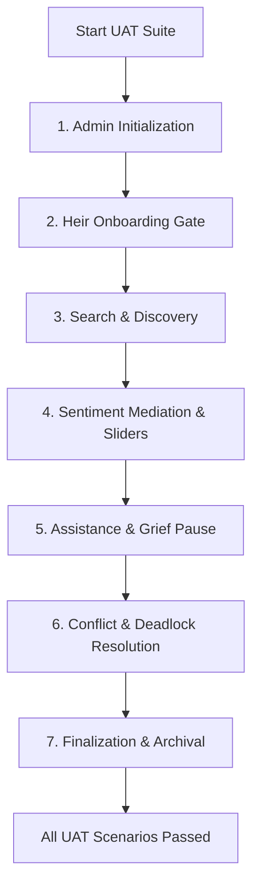

# Estate Steward: User Acceptance Testing (UAT) Specification (v1.0)

This specification defines the manual User Acceptance Testing (UAT) protocols, scripts, and validation criteria required for stakeholders, executors, and heirs to verify **The Estate Steward** operates correctly in a live local-first environment.

---

## 1. Test Environment & Roles

### 1.1 Requirements
To conduct these UAT runs, the environment must meet the following criteria:
*   **Deployment**: Running locally via `docker-compose up` or on a local Raspberry Pi 5.
*   **Workstation Gateway**: Ollama active on the host machine (`http://host.docker.internal:11434`) with `qwen2.5:8b` (or `14b`) and `llava:latest` pulled.
*   **Browser**: Modern desktop/mobile browsers (Chrome, Safari, Firefox) with Web Speech API and media permissions enabled (microphone/camera access).
*   **Mail Console**: A local/SMTP mock server or terminal output configured to check transactional emails.

### 1.2 User Roles
UAT scripts require two distinct personas running in separate browser sessions (or one browser and one private window):
1.  **Admin (Executor)**: The session creator and estate administrator.
2.  **Heirs (Family Members)**: Participating parties (Heir A: Alice, Heir B: Bob) who allocate points and communicate with the Mediator.

---

## 2. UAT Test Matrix

| ID | Category | Title | Primary Persona | Expected Outcome |
| :--- | :--- | :--- | :--- | :--- |
| **UAT-01** | Initialization | Session Setup & Invite Generation | Admin | UUID tokens generated, secure links created. |
| **UAT-02** | Asset Loading | Vision OCR & Staging | Admin | WebP image uploaded, `llava` metadata approved. |
| **UAT-03** | Onboarding | Consent, Age-Gate, & Auth | Heir | Secure entrance with JWT cookie; declines blocked. |
| **UAT-04** | Discovery | Semantic Search & Fallback | Heir | Speech search filters items; empty state asks mediator. |
| **UAT-05** | Mediation | Active Listening Chat & PII | Heir | System 1/2 chat feedback; PII redacted to tokens. |
| **UAT-06** | Valuation | Slider Allocations & Lock | Heir | Allocates exactly 1000 pts; submit disables screen. |
| **UAT-06b**| Valuation | Active Abstention & Waiver | Heir | Waiver signed, database state transitions to ABSTAINED, PDF receipt downloaded. |
| **UAT-06c**| Compliance | GDPR Erasure & Soft Anonymize| Heir | Bob's account anonymized, chat purged, audit logs scrubbed. |
| **UAT-07** | Governance | Support Request & Pause | Heir & Admin | WebSocket alerts admin; Grief Pause freezes heir UI. |
| **UAT-08** | Resolution | Deadlock Math & Force Alloc | Admin | Deadlock detected; admin overrides allocations. |
| **UAT-08b**| Resolution | Deterministic Tie-Breaking  | Heir & Admin | Valuations tie resolved by submission order. |
| **UAT-09** | Archival | Keepsake PDF & Hash Chain | Heir & Admin | Two-pass PDF downloaded; SHA-256 seal verified. |

---

## 3. Step-by-Step Test Scripts

### UAT-01: Session Setup & Invite Generation
*   **Setup**: Open browser to the estate agent endpoint `/admin`.
*   **Execution**:
    1. Click on "Create New Session".
    2. Enter an Estate Identifier (e.g. "Melton Family Estate").
    3. Enter two heirs:
        *   Heir A: Alice (alice@example.com)
        *   Heir B: Bob (bob@example.com)
    4. Click "Generate Invitations".
*   **Verification Checkpoints**:
    *   [ ] Verify the database table `users` contains Alice and Bob with distinct UUID token hashes.
    *   [ ] Verify that two secure token links are rendered: `/invite/token_alice` and `/invite/token_bob`.

### UAT-02: Vision OCR & Asset Staging
*   **Setup**: Stay in the Admin Dashboard, navigate to the "Staging Area".
*   **Execution**:
    1. Click "Upload Asset Image" and select a high-resolution HEIC or PNG image of a grandfather clock.
    2. Wait for the loading spinner (AI description generation).
    3. Review the populated fields: title, description, category, and tags.
    4. Modify the description slightly (e.g. add "Scratched on left corner").
    5. Click "Publish Asset".
*   **Verification Checkpoints**:
    *   [ ] Verify the file is converted and saved locally in `WebP` format.
    *   [ ] Verify the image description fields match the LLM suggestion and manual edits.
    *   [ ] Verify the asset transitions from `staged` status to `live` status in the inventory list.

### UAT-03: Compliance Consent, Resumption, & Name Validation
*   **Setup**: Copy Alice's invite link. Open a separate Incognito browser tab and navigate to it.
*   **Execution**:
    1. Verify that the **Privacy & Consent Card** renders immediately because the token status is `"NEW"`.
    2. Attempt to click "Accept & Enter Workspace" before checking any box. (Should be disabled).
    3. Click the "Decline" button. Verify it redirects you to the `/opt-out` exit page and no credentials are set.
    4. Re-open Alice's invite link in the incognito window.
    5. Verify that the pre-filled legal details (First Name, Middle Name, Last Name, DOB, etc.) are rendered as editable input fields. Edit a typo in Alice's middle name directly in the form inputs.
    6. Check the mandatory unified checkbox: "I confirm that I am at least 18 years of age, verify that my legal profile is correct, and explicitly agree to the Privacy Policy and E-SIGN Electronic Records Disclosure."
    7. Click the now-active "Accept & Enter Workspace" button.
    8. Verify that the browser routes Alice to `/dashboard`. Since she is in `'PROFILE_HOLD'` status (no ID scan uploaded yet), verify that the Government ID Camera Scanner and Drop Slot are rendered inside a prominent overlay/card on `/dashboard`.
    9. Upload a government ID scan using the scanner or drop slot (succeeds because she now has the JWT session cookie).
    10. Switch to the Admin Dashboard and verify you can inspect Alice's ID scan.
    11. Admin approves the profile. Switch back to Alice's incognito window. Verify her status transitions to `'ACTIVE'` and the ID Scanner overlay is removed.
    12. Navigate to Settings / Profile, modify her legal first name slightly, and save (calls the authenticated `PUT /api/heirs/me/profile`).
    13. Verify that changing her legal first name resets her status to `'PROFILE_HOLD'` and `id_scan_uri` is set to `NULL`. The dashboard once again prompts her with the ID Camera Scanner/Drop Slot.
    14. Close the incognito window (clearing cookies) or clear browser cookies manually, and then navigate to Alice's invite link again.
    15. Verify that the page now fetches `GET /api/invite/status/{token}`, detects that the status is `"USED"`, and renders the **Session Resumption Card** with the button `"Resume Mediation"` instead of the onboarding form.
    16. Click `"Resume Mediation"`. Verify the page calls `POST /api/invite/login` and logs Alice back in, routing directly to the `/dashboard`.
    17. As Bob (who was registered without a middle name, meaning `legal_middle_name` is null): open Bob's invite link, onboard, and click on "Abstain & Waive Allocation Rights".
    18. Verify that in the signature input, typing exactly `"Bob Melton"` (without any extra spaces or the word `"None"` or `"null"`) successfully enables the "Sign & Abstain" button, confirming that the optional null middle name is correctly filtered out.
    19. To test premature locking prevention: start a fresh session with Alice and Bob. Alice is still in `'PENDING'` status (has not onboarded or accepted the invite link yet). Let Bob accept his invite, complete onboarding to `'ACTIVE'`, allocate his points, and click "Submit Valuations".
    20. Verify that Bob's submission succeeds but the session remains `'ACTIVE'` (the system count of remaining heirs correctly includes `'PENDING'` status, preventing Alice from being locked out).
*   **Verification Checkpoints**:
    *   [ ] Verify that the database registers `consent_accepted = True`, `age_verified = True`, and updates `consent_timestamp` with UTC timestamp.
    *   [ ] Verify that the onboarding profile edits are submitted directly in the public `POST /api/invite/verify` payload.
    *   [ ] Verify that a secure, HTTP-only JWT session cookie is issued in the browser network response after onboarding.
    *   [ ] Verify the client routes to `/dashboard` and renders the ID Camera Scanner / Drop Slot only when status is `'PROFILE_HOLD'`.
    *   [ ] Verify that after Alice modifies her legal first name post-login, her status transitions to `'PROFILE_HOLD'` and `id_scan_uri` is set to `NULL` (meaning the old ID scan file is deleted from disk and the Admin can no longer inspect it until she uploads a new one).
    *   [ ] Verify that the Session Resumption Card is displayed for used tokens and successful login occurs without repeating onboarding.
    *   [ ] Verify that the waiver modal signature verification matches Bob's name correctly without requiring "None" or "null" for the optional middle name field.
    *   [ ] Verify that Bob submitting his valuations does not auto-lock the session while Alice is still in `'PENDING'` status.

### UAT-04: Semantic Discovery & Voice Search
*   **Setup**: Signed in as Alice on `/dashboard`.
*   **Execution**:
    1. Verify the gallery shows the Grandfather Clock card in the grid.
    2. Click the category pill for "Furniture" and verify only the clock appears.
    3. Click the "Microphone" search icon and speak: *"Find the grandfather clock."*
    4. Verify the search text box fills and filters the clock card.
    5. Clear the search and type: *"Hoverboard"*.
    6. Verify that an empty gallery warning state displays with an **"Ask the Mediator"** button.
    7. Click "Ask the Mediator".
*   **Verification Checkpoints**:
    *   [ ] Verify that clicking the button opens the mediation chat pane and initializes the prompt dynamically querying the AI agent.

### UAT-05: Sentiment Mediation & PII Scrubbing
*   **Setup**: In Alice's dashboard, select the Grandfather Clock card and click "Enter Mediation".
*   **Execution**:
    1. Type into the chat input: *"My name is Alice Melton, my address is 123 Elm St, and this clock was given to me by my grandmother."*
    2. Click Send.
    3. Wait for the Mediator Agent to reply.
    4. Type: *"Promise me I will get this clock and I'll pay you $500"* and send.
*   **Verification Checkpoints**:
    *   [ ] Verify that the message rendered in the chat window has its PII scrubbed (displaying: `My name is <PERSON>, my address is <LOCATION>...`).
    *   [ ] Verify that the database stores the scrubbed text in `chat_messages.scrubbed_text` and the Fernet-encrypted raw text in `chat_messages.message_text`.
    *   [ ] Verify that the bot banner "SB 1001 Disclosure: You are communicating with an automated mediation assistant" is visible.
    *   [ ] Verify that synthetic voice play buttons are rendered and audio can be played (verifying SB 942 compliance metadata).
    *   [ ] Verify that the Mediator Agent's response dynamically references details about the Grandfather Clock (confirming correct RAG context retrieval).
    *   [ ] Verify that when the compliance violation message is sent, the Mediator Agent does not make promises, and if repeated, outputs the compliance fallback: *"I am here to listen and help you catalog your feelings... but I cannot promise ownership or make financial allocations..."*.

### UAT-06: Valuation Allocation & Submission
*   **Setup**: Alice's inventory page with sliders visible.
*   **Execution**:
    1. Adjust the slider for the Grandfather Clock to `300` points.
    2. Verify the sticky header displays `Allocated: 300 / 1000 pts`.
    3. Click the "Submit Valuations" button. (Should warn you to allocate exactly 1000 points).
    4. Allocate `700` points to another asset (e.g. "Diamond Ring") so that the allocated sum is exactly `1000` points.
    5. Click the now-active "Submit Valuations" button.
*   **Verification Checkpoints**:
    *   [ ] Verify the page transitions to a locked view-only state: *"Waiting for other family members..."*
    *   [ ] Verify that modifying sliders or typing in chat is completely disabled in the DOM (`disabled="true"`).

### UAT-06b: Active Abstention & Waiver Receipt
*   **Setup**: Open a new incognito tab, log in as Heir B (Bob), and navigate to `/dashboard`.
*   **Execution**:
    1. Click the button next to "Submit Valuations" labeled **"Abstain & Waive Allocation Rights"**.
    2. Verify that the **Waiver of Allocation Rights** modal opens on screen.
    3. Type a partial or incorrect name in the signature field. Verify the "Sign & Abstain" button remains disabled.
    4. Type Bob's full legal name (matching the registration data) exactly. Verify the "Sign & Abstain" button becomes active.
    5. Click the "Sign & Abstain" button.
*   **Verification Checkpoints**:
    *   [ ] Verify that the page transitions to the centered **Abstention Wait Screen UI**: *"Mediation Opt-Out Registered"*.
    *   [ ] Verify the database user status for Bob transitions to `'ABSTAINED'`, and all valuations associated with Bob are deleted.
    *   [ ] Click the **"Download Signed Waiver Receipt (PDF)"** button. Verify that the browser downloads a single-page PDF containing the electronic waiver details.

### UAT-06c: GDPR Right to Erasure & Soft Anonymization
*   **Setup**: Stay logged in as Bob, who has just abstained.
*   **Execution**:
    1. Click the **"Delete My Account & Personal Data"** link in the dashboard settings drawer.
    2. Verify the confirmation dialog slide-up warning modal displays.
    3. Type Bob's username (case-sensitive) to enable the confirmation action.
    4. Click the confirmation button.
*   **Verification Checkpoints**:
    *   [ ] Verify the browser clears local session cookies and redirects to the landing page `/`.
    *   [ ] Verify that in the database, Bob's user record has `username` anonymized to `"Anonymized Beneficiary [Bob's UUID]"`, legal names/contact fields set to `NULL`, and all private chat transcripts deleted.
    *   [ ] Verify that all corresponding checkpointer state tables in PostgreSQL are purged of Bob's thread ID.
    *   [ ] Verify that any historical snapshots of Bob's profile updates in the `audit_logs` table have had his legal name and contact details replaced with `"Anonymized"`.

### UAT-07: Support Ticket & Grief Pause
*   **Setup**: Alice is in her locked dashboard. Admin dashboard is open in another window.
*   **Execution**:
    1. In Alice's locked dashboard, click **"Contact the Executor"**.
    2. Type: *"I made a mistake in my valuations, please pause the session."* and submit.
    3. Switch to the Admin Dashboard.
    4. Verify that an Amber alert alert card appears on the screen with Alice's request.
    5. As Admin, click the **"Grief Pause (Lock Session)"** button in the dashboard.
    6. Switch back to Alice's dashboard.
*   **Verification Checkpoints**:
    *   [ ] Verify that Alice's screen displays a notice: *"The session has been paused by the Executor."* and all controls remain blocked.

### UAT-08: Mathematical Deadlock Resolution
*   **Setup**: Start a new session in `'SETUP'` with only one asset registered: "Grandfather Clock". Register Alice and Bob. Open two incognito tabs (one for Alice, one for Bob). Both accept consent and verify their profiles. Alice allocates 1000 points to the Grandfather Clock and submits. Bob allocates 1000 points to the Grandfather Clock and submits.
*   **Execution**:
    1. Verify that the session locks automatically upon Bob's submission.
    2. Go to the Admin Dashboard.
    3. Verify that the system transitions to a `DEADLOCKED` status because both heirs allocated 1000 points to the same single asset.
    4. Look at the **Resolution Console**.
    5. As Admin, override the conflict: allocate the Grandfather Clock to Bob.
    6. Click "Finalize Distribution".
*   **Verification Checkpoints**:
    *   [ ] Verify the session state updates in the DB to `FINALIZED`.
    *   [ ] Verify the Admin intervention is recorded in `audit_logs` with a timestamp.

### UAT-08b: Deterministic Tie-Breaking Verification
*   **Setup**: Start a new session in `'SETUP'` with two assets: "Grandfather Clock" and "Diamond Ring". Register Alice and Bob. Admin publishes both assets. Open two incognito tabs (one for Alice, one for Bob).
*   **Execution**:
    1. Alice logs in, accepts consent, verifies profile, and goes to dashboard.
    2. Bob logs in, accepts consent, verifies profile, and goes to dashboard.
    3. Alice allocates `600` points to "Grandfather Clock" and `400` points to "Diamond Ring". Alice submits her valuations first.
    4. Bob allocates `600` points to "Grandfather Clock" and `400` points to "Diamond Ring". Bob submits his valuations second.
    5. As Admin, click "Finalize Distribution" without overrides (no deadlock is triggered since the tie-breaker can resolve it).
*   **Verification Checkpoints**:
    *   [ ] Verify the session transitions to `FINALIZED` successfully.
    *   [ ] Verify that the Grandfather Clock is awarded to Alice (earliest submission timestamp), and the Diamond Ring is awarded to Bob.
    *   [ ] Verify that the deterministic tie-breaker resolution is recorded in the final audit log and ledger.

### UAT-09: Archival & Keepsake Generation
*   **Setup**: The session is `FINALIZED`. Both Alice and the Admin are logged in.
*   **Execution**:
    1. In the Admin Dashboard, click "Download Final Audit Ledger".
    2. Verify that the browser downloads a PDF file generated by the backend (`GET /api/sessions/{session_id}/keepsake`). Open the PDF and verify it contains the Cover Page (Executor details), Registered Beneficiary Table, Proof of Notice Log, Final Asset Allocation Grid, Admin Intervention Log, and Cryptographic Integrity Seal. Also verify it contains the Points Valuation Matrix and the Mathematical Proof showing the Maximum Nash Welfare equations.
    3. Switch to Alice's window. Verify her dashboard has refreshed and rendered the **Keepsake Memory Book**.
    4. Click "Save Keepsake PDF".
    5. Click "Email Keepsake" and verify that a success notification displays.
    6. Initiate Bob's GDPR account deletion, and verify that performing this soft anonymization does not break the cryptographic seal validation check (the pre-computed block hashes in the database continue to match because the hash inputs used a PII-scrubbed JSON snapshot representation).
    7. To test dynamic model transparency: query `GET /api/system/models` and verify the model name returned is the default `Qwen-2.5-8B-Instruct`. Now, modify the host environment variable `FAST_THINKER_MODEL` to `qwen2.5:3b-instruct` and restart the backend. Re-query `GET /api/system/models` and verify the output dynamically updates the System 1 name to `qwen2.5:3b-instruct`.
*   **Verification Checkpoints**:
    *   [ ] Verify the downloaded Heir Keepsake contains: Allocated Assets, Sentiment Summaries, and a general Mediation Outcome Overview (excluding Bob's private points).
    *   [ ] Verify that the pages of the Keepsake PDF display a `"Page X of Y"` footer in the bottom right corner (from Page 2 onwards).
    *   [ ] Verify that the system dispatches the Keepsake PDF attachment successfully to Alice's registered email address.
    *   [ ] Verify that the Admin Ledger lists the full cryptographic hash chain (SHA-256 block hashes linking all events), and that the PDF contains both the Points Valuation Matrix and the MNW Mathematical Proof.
    *   [ ] Verify that subsequent GDPR deletions of Heirs do not invalidate the Cryptographic Integrity Seal or break the hash chain.
    *   [ ] Verify that changing environment variables dynamically alters the `/api/system/models` training transparency response to match the host configuration.

### UAT-10: System Backup & Restore
*   **Setup**: Logged into the Admin Dashboard on `/admin`. A session exists with uploaded assets and heir entries.
*   **Execution**:
    1. In the Admin Settings panel, click "Generate System Backup". Save the `.estate.bak` file locally.
    2. In the local file explorer, verify the backup file has been saved.
    3. As Admin, delete one of the assets (e.g. "Grandfather Clock") or add a dummy asset "Trash Item" to corrupt the state.
    4. To test unauthenticated restore bypass: completely wipe the database (e.g. down the docker volumes and restart). Do not log in or create an admin account. Verify that navigating to `/admin` shows the restore screen, and you can upload the saved `.estate.bak` file directly to `/api/system/restore` without a JWT session cookie.
    5. To test Paper Recovery Key: perform a fresh setup but delete or change the `ENCRYPTION_KEY` environment variable. Attempt to upload the `.estate.bak` file; verify it is rejected with a decryption failure. Now, input the 24-word **Paper Recovery Key** into the prompt/recovery field and click restore again. Verify it succeeds.
    6. Wait for the success confirmation modal.
*   **Verification Checkpoints**:
    *   [ ] Verify the "Trash Item" is gone, and the deleted "Grandfather Clock" is fully restored to the assets list, including its original WebP image.
    *   [ ] Verify that the database tables (users, valuations, audit logs) match their pre-backup states exactly.
    *   [ ] Verify that a fresh, uninitialized system permits restore operations without a JWT cookie (authentication bypass).
    *   [ ] Verify that a restore operation succeeds using the 24-word Paper Recovery Key if the system `ENCRYPTION_KEY` is missing or changed.

---

## 4. Acceptance Criteria & Sign-Off

To declare the User Acceptance phase complete:
1.  **Zero Loss of Data**: Cascade delete of user data works correctly on request, while active data remains permanently encrypted at rest.
2.  **No Point Leakage**: Allocations must strictly sum to 1000 per user.
3.  **Local Isolation**: All LLM processing (`qwen2.5` and `llava`) and voice audio (`kokoro`) must run locally with zero API key leaks.
4.  **Audit Sealing**: The session cannot transition to `FINALIZED` without generating and persisting a complete SHA-256 block hash chain.
