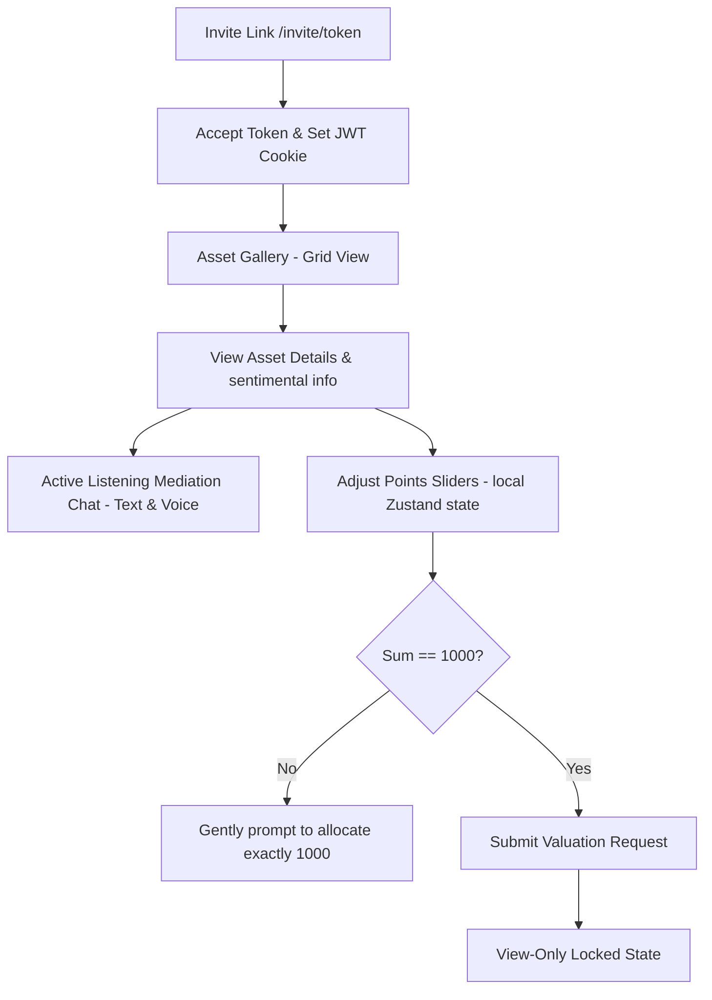
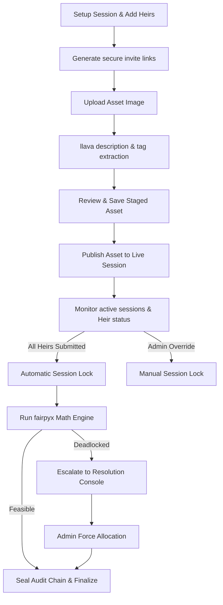

# Estate Steward: User Journeys & Interactive Workflows (v1.0)

This document maps the exact step-by-step user journeys and state transitions for both the **Heir** and the **Admin** personas. It provides the definitive UX/UI flow and API integration logic for developers and AI agents.

---

## 1. The Heir Journey (The "Reflection" Path)

The Heir's interface is designed as a calm, slow-paced sanctuary. It minimizes cognitive strain, avoids flashing notifications, and enforces a reflective decision-making pace.



### Step 1: Entry & Authentication (Consent & Onboarding)
1.  **Entry Point**: The Heir receives a secure, single-use invitation link from the Admin (e.g., `https://estate-steward.local/invite/550e8400-e29b-41d4-a716-446655440000`).
2.  **Consent & Age Agreement Screen**:
    *   Navigating to the link renders the **Privacy & Consent Card** on the client side before any registration takes place.
    *   The Heir reviews their data rights (including data portability, at-rest encryption, PII filtering, and the right to delete account records).
    *   **Age Verification Gate**: The Heir must check the mandatory age verification checkbox confirming they are 18+ or have guardian consent. The "Accept & Enter Workspace" action button is disabled until this is checked.
    *   **Decline Action**: If they decline, the browser redirects to an opt-out page, and no credentials or accounts are created.
3.  **Authentication Handshake & Identity Verification Onboarding**:
    *   If they accept and verify age, the frontend sends a **single atomic** `POST /api/invite/verify` request containing the token, consent flags (`consent_accepted: true`, `age_verified: true`), legal profile fields (`legal_first_name`, `legal_middle_name`, `legal_last_name`, `relationship_to_decedent`, `date_of_birth`), **and** structured physical address fields (`address_line1`, `address_line2`, `address_city`, `address_region`, `address_postal_code`, `address_country`). These fields are pre-populated from the Executor's data and are fully editable to ensure accurate records are committed in the same transaction.
    *   The backend validates the token, verifies that the compliance flags are `true`, updates the Heir user record (setting `invite_token_used = True`, `consent_accepted = True`, `age_verified = True`, `consent_timestamp = UTC_NOW`, and any corrected profile fields), sets the Heir's status to `'PROFILE_HOLD'`, and issues a secure HTTP-only JWT cookie.
    *   **ID Upload**: After the consent call completes, the browser displays the Government ID Verification form. The Heir uploads or camera-captures their government ID (`POST /api/heirs/me/upload-id`). The backend encrypts the scan, saves it at `id_scan_uri`, and the Heir remains in `'PROFILE_HOLD'`.
    *   **Verification Gate**: The Heir is client-routed to `/dashboard` in a read-only locked state (sliders and mediator chat disabled) while verification is pending. The Executor inspects the ID in the Admin Panel (`POST /api/heirs/{heir_id}/verify-identity` with action approve or reject).
        - *Approval*: Transitions Heir status to `'ACTIVE'`, seeds default `0`-point valuations for all existing `'LIVE'` assets, logs the action, deletes the ID scan file permanently from disk, and sends a WebSocket alert unlocking the Heir's sliders and chat.
        - *Rejection*: Deletes the ID scan from disk, resets `id_scan_uri = NULL`, keeps the Heir in `'PROFILE_HOLD'`, and triggers a WebSocket alert prompting the Heir to correct their profile details (calling `PUT /api/heirs/me/profile`) and re-upload their ID scan (calling `POST /api/heirs/me/upload-id`) for Executor re-verification.
    *   **Setup Holding State**: If the session status is `'SETUP'`, even verified heirs have their sliders and chat mediator inputs locked. The dashboard renders: *"Welcome! The Executor is currently setting up the estate catalog. Sliders and mediation chat will unlock once the session is launched."*
    *   **Launch Transition**: The moment the Admin clicks **"Launch Session"** (transitioning the status to `'ACTIVE'`), a WebSocket event updates the client-side Zustand store and immediately unlocks all sliders and chat mediation components for verified, `'ACTIVE'` status heirs.


#### Phase A: Discovery (Knowing What is There)
1.  **Gallery Entry**: Upon redirect, Heirs enter the main Asset Gallery. The focus is purely on exploration—point sliders and submit actions are hidden to reduce early-stage decision anxiety.
2.  **Voice-Activated Search & Filter**:
    *   To make phone navigation seamless, Heirs can tap a microphone icon located in the main search bar.
    *   Using the Web Speech API, they can speak commands like *"Find the grandfather clock"*, *"Show jewelry"*, or *"Search for items made of mahogany"*.
    *   The browser converts the speech to text, updates the search field, and instantly triggers the backend semantic/hybrid RAG search, showing matching items in the grid.
3.  **Low-Confidence Search Fallback**:
    *   If no assets meet the $75\%$ similarity threshold, the gallery displays an empty state warning card with an **"Ask the Mediator"** button.
    *   Clicking the button opens the chat workspace and triggers a query directly with the agent (e.g. *"Did you find any [Search Query] in the estate?"*).
    *   The backend runs the query, and the Mediator Agent replies to the user, proposing synonym alternatives or listing related items.
4.  **Manual Navigation**: Heirs can also click tactile category pills (e.g. *Jewelry, Furniture, Art, Other*) to filter the grid manually.

### Phase B: Mediation & Valuation (Deciding the Value)
1.  **Asset Selection**: Clicking a card in the gallery transitions the Heir to the Selected Asset Detail view.
2.  **Private Shuttle Mediation (Voice & Text)**:
    *   Heirs chat with the Mediator Agent about the selected asset. They can speak into their phone using hold-to-talk to discuss personal stories and sentimental value.
    *   Conversations are routed to System 1 (Qwen-2.5-8B) for active listening, while System 2 checks constraints.
3.  **Story-to-Slider Alignment (Loopback)**:
    *   If the Heir expresses high sentimental attachment in the chat but has not allocated points, System 2 triggers a loopback instruction, and the Mediator Agent gently prompts them to adjust their slider points to match their words.
4.  **Points Allocation**:
    *   The Heir adjusts the points slider (0-1000) for the asset. The values update locally in Zustand.
    *   A sticky header at the top of the dashboard displays their overall progress: `Allocated: X / 1000 pts`.
5.  **Sentimental Story Sharing**:
    *   Alongside point allocation, the Heir can write a sentimental memory about the asset.
    *   By selecting the *"Share this memory with my family"* checkbox, they permit other heirs to read this text once submitted.
    *   Heirs can browse other heirs' shared memories under the *"Family Memories"* panel. They can only read these stories; they cannot comment on them, reply, or see how many points the other heir allocated to the asset.

### Phase C: Submission & Resolution (Sealing Outcomes)
1.  **Valuation Submission**:
    *   Once the Heir allocates exactly 1000 points across the inventory, the "Submit Valuations" button unlocks.
    *   Upon submission, the database writes the values using pessimistic locking.
    *   The Heir's dashboard transitions into a read-only locked state, displaying a calm message: *"Waiting for other family members to submit."*
2.  **Post-Submission Abstention**: Even after submission, the Heir can still click **"Abstain & Waive Allocation Rights"** if they change their mind. This transitions their status from `'SUBMITTED'` to `'ABSTAINED'`, deletes all their valuation data from the solver matrix, records the signed abstention waiver in the audit chain, and renders the Abstention Wait Screen (§8.9). The "Abstain" button must remain visible and functional in the post-submission locked state.
3.  **Keepsake Unlocking**: Once the Admin finalizes the session, the locked dashboard transitions to the **Keepsake Memory Book** (Heir Step 5), displaying their allocated items and personal stories.

---

## 2. The Admin Journey (The "Custodian" Path)

The Admin's interface is information-dense, structured, and focused on maintaining governance, safety, and resolving deadlocks.



### Step 0: Session Setup, Onboarding Checklist & Invitation Generation
1.  **Session Creation**: The Admin navigates to the Admin Panel and creates a new Estate Mediation Session.
2.  **Admin Onboarding & Setup Checklist**: Before a session can transition to `'ACTIVE'`, the Admin must satisfy the requirements of the `AdminSetupChecklist`:
    *   **Settings Configuration**: Verifies or updates LLM API keys (via LiteLLM / Settings tab), storage driver configurations (LOCAL/S3/GCS), and SMTP email settings.
    *   **Estate Setup Requirements**: Confirms at least two heirs are registered, at least five assets are staged/published, and session categories are configured.
3.  **Heir Registration**: The Admin enters the names and verified email addresses of the participating Heirs.
4.  **Token Generation**: The system creates individual profiles for each Heir, generating a unique secure UUID token (e.g., `550e8400-e29b-41d4-a716-446655440000`).
5.  **Invitation Dispatch**: The Admin copies the generated invitation links `/invite/{token}` or clicks "Send Invites" to dispatch them to Heirs (using SMTP if configured).

### Step 1: Asset Staging, Multi-Image Uploads & Vision OCR
1.  **Asset Upload**: The Admin uploads a primary image and optional secondary images of an estate asset.
2.  **Multi-Image Staging**: The Admin labels the angle/purpose of each uploaded image (e.g. `'Primary'`, `'Detail'`, `'Back'`) which are saved in the `asset_images` table.
3.  **Vision Inference**: The backend sends the primary image to the configured vision provider via the LiteLLM router (defaulting to local `llava`).
4.  **Metadata Extraction**: The vision model extracts:
    *   A descriptive title and detailed markdown description.
    *   Suggested session-specific category.
    *   Sentimental attributes and keywords.
5.  **Review**: The Admin views the generated metadata, adjusts details (or category labels) in the staging form, and saves it. The asset transitions from `STAGED` to `LIVE`.

### Step 2: Governance & Session Monitoring
1.  **Monitoring Console**: The Admin views a table of Heirs, tracking:
    *   Who has accessed their invite links.
    *   Active/Idle status.
    *   Submission status (Submitted / In-Progress).
2.  **Session Locking**:
    *   **Automatic Lock**: Triggered automatically the moment all Heirs successfully submit their valuations.
    *   **Manual Lock**: The Admin can click "Grief Pause" or "Lock Session" at any point, freezing all Heir inputs.

### Step 3: Deadlock & Resolution Console
1.  **Conflict Evaluation**: Once the session locks, the backend executes the `VALIDATE_NODE` which runs the `fairpyx` fair division algorithm.
2.  **Deadlock State**: If the valuation points cannot resolve to a mathematically fair solution (due to mutually exclusive point maximums on multiple objects), the state is flagged `is_deadlocked = True`.
3.  **Resolution Console**:
    *   The Admin is alerted via the UI and views the conflicting assets.
    *   The Admin uses the **"Force Allocation"** interface to manually override specific asset points for Heirs. **Fiduciary Justification**: The Admin must select or enter a *Fiduciary Basis* (e.g. *'Decedent\'s Will Article 3'* or *'Mutual Written Agreement of Heirs'*) explaining the override.
    *   The manual adjustment triggers an `ADMIN_OVERRIDE` event, writes the encrypted state snapshot and the fiduciary justification to the database, and overrides the deadlock.
    *   The system broadcasts a WebSocket alert to all heirs notifying them of the override, detailing the adjustment and its fiduciary basis.

### Step 4: Finalization & Auditing
1.  **Commit**: Once resolved, the Admin clicks a "Finalize Distribution" button.
2.  **Hash Sealing**:
    *   The system generates the final audit log entry.
    *   The backend calculates the SHA-256 block hash, linking it directly to the previous block's hash.
    *   The final state is written to the database, assets transition to `DISTRIBUTED`, and the session is archived.

### Step 5: Audit Archiving & Report Export
1.  **Export Final Audit Ledger**: 
    *   The Admin clicks "Download Final Audit Ledger" in their dashboard.
    *   The frontend issues an authenticated request to `GET /api/sessions/{session_id}/keepsake`, which returns a server-generated PDF binary stream (built using ReportLab with `NumberedCanvas` pagination and two-pass rendering). The browser downloads the resulting PDF file containing the Session Overview, the Final Asset Allocation Table, the Points Valuation Matrix (comparing all allocations), the Mathematical Proof, the Admin Intervention Log, and the Cryptographic Hash Chain sequence.
    *   **Note**: The CSS `@media print` styles defined in the UI spec serve as a complementary feature for ad-hoc in-browser print convenience, but are **not** the primary mechanism for generating the court-admissible PDF ledger. The server-generated ReportLab PDF is the authoritative output.
2.  **Physical Archival**: The Admin prints the ledger for physical executor records.

---

## 3. Heir Journey - Post-Mediation Keepsake

Once the Admin finalizes the distribution, the Heir's dashboard unlocks a secondary stage:

### Step 5: Keepsake Export & Sharing (Heir)
1.  **Interactive Summary**: The Heir reviews the final outcome, seeing exactly which sentimental assets have been allocated to them, alongside their original points, the stories and thoughts they logged, and the Mediator Agent's active-listening summaries. They also see a clean Mediation Outcome Overview showing what other heirs received, without exposing their private points or stories.
2.  **Local PDF Save**: The Heir clicks "Save Keepsake PDF" to render their personal Memory Keepsake (Allocated Assets, Sentiment & Stories, Mediator Summaries, and Mediation Outcome Overview) directly through the browser native engine as a PDF download.
3.  **Email Delivery**:
    *   If SMTP is configured on the backend, the Heir can click "Email My Keepsake".
    *   The backend formats the keepsake and emails it to the Heir's registered email address as a secure, private PDF attachment.

---

## 4. Technical Glitch & Assistance Flow

If an Heir experiences a technical issue, has a question, or gets overwhelmed, they can trigger the support request flow:

```
[ Heir clicks "Contact Executor" ] ---> [ Fills message and submits ]
                                                       |
[ Admin Dashboard pulses Amber alert ] <---------------+---> [ Optional Admin SMTP Email Notification ]
               |
[ Admin reviews message & resolves / Pauses session ]
```

1.  **Filing the Request (Heir)**: The Heir clicks the *"Contact the Executor"* link, types a message (e.g. *"I'm stuck on my points allocation"*, *"Can you pause the session for a moment?"*, or *"The mic button is not working"*), and clicks Send.
2.  **Notification (Admin)**: 
    *   A WebSocket notification immediately pushes to the Admin console, showing a pulsing Amber alert next to the active session.
    *   If SMTP email environment variables are active, the backend asynchronously emails the Admin: *"Heir [Name] is requesting help: '[Message]'."*
3.  **Governance Response (Admin)**: 
    *   The Admin opens the unresolved requests drawer inside the **Admin Communications Panel**.
    *   The Admin views the message and any uploaded heir attachments.
    *   The Admin can type a direct response (`admin_response`), optionally attach a screenshot, and click **"Send Reply"** (changing the status to `'RESPONDED'`).
    *   If the Heir requested a pause or is overwhelmed, the Admin clicks **"Grief Pause (Lock Session)"** directly from the lifecycle panel. This immediately disables the sliders on all Heir panels.
    *   Once handled, the Admin clicks **"Mark Resolved"** to archive the ticket, transition status to `'RESOLVED'`, and resume the session.


